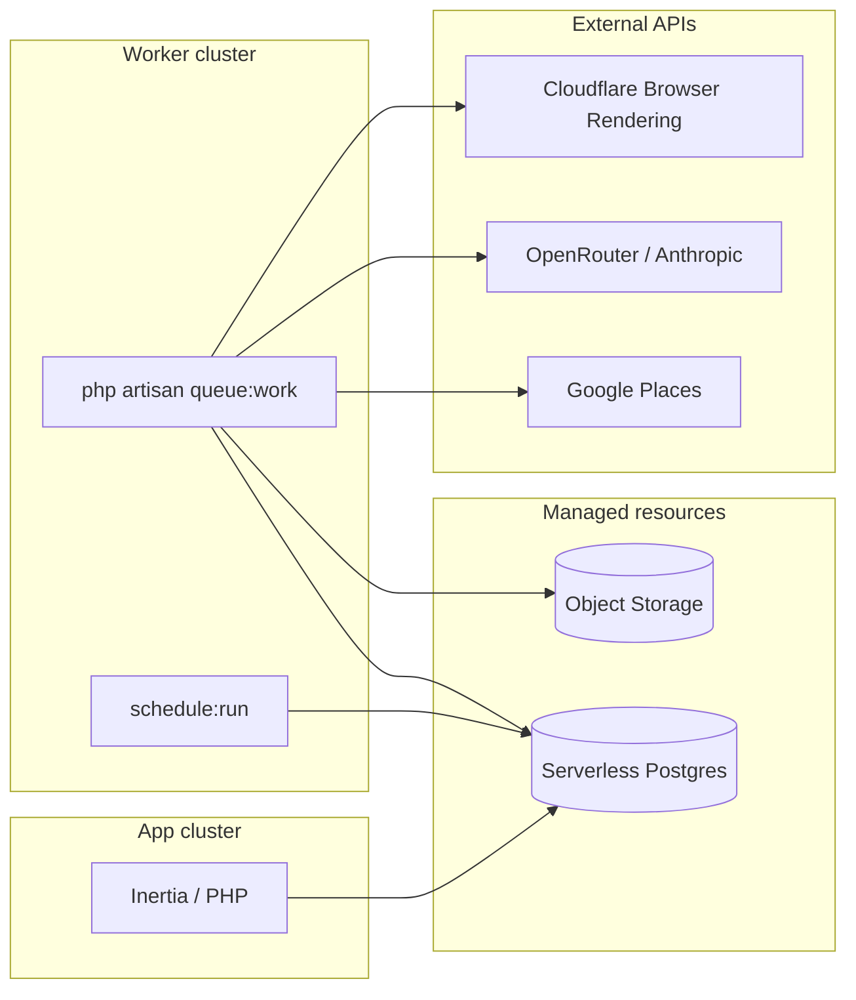
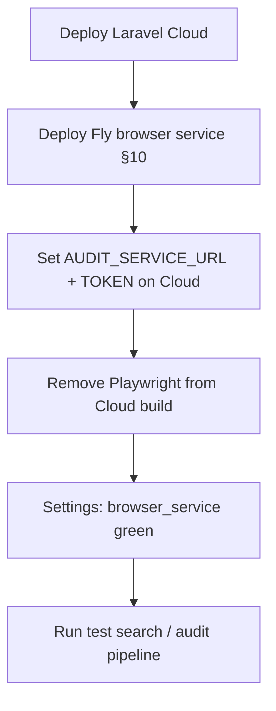

# Laravel Cloud deployment guide

Deploy checklist for the nthdesigns prospect scanner, including browser automation options and costs on Laravel Cloud.

---

## Architecture on Cloud



| Workload | Where it runs |
|----------|---------------|
| Web UI, auth, settings | App cluster |
| `scraping` queue (Places, scoring) | Worker cluster via `queue:work` (jobs in Postgres `jobs` table) |
| `auditing` queue (audit, screenshots, reports) | Worker cluster via `queue:work` |
| Daily `scanner:purge-expired` | Scheduler on App or Worker cluster |
| Report / violation images | Laravel Object Storage (R2) |

**Queue driver:** production uses `QUEUE_CONNECTION=database` (not Redis). Horizon is not used — it only supports the Redis driver. Run `php artisan queue:work` on the worker cluster instead.

---

## Pre-flight checklist

Before connecting the repo to Laravel Cloud:

- [ ] App uses PostgreSQL locally (Cloud does not support SQLite in production)
- [ ] `composer.json` / `composer.lock` committed
- [ ] `package-lock.json` committed (root + `scripts/`)
- [ ] Google Places API key with Places API (New) enabled
- [ ] OpenRouter API key (Anthropic models)
- [ ] Cloudflare account (optional now, needed for Browser Rendering fallback)
- [ ] First admin user seeder or registration flow ready
- [ ] `jobs` and `failed_jobs` tables migrated (`php artisan migrate` includes them)

---

## 1. Create resources (infrastructure canvas)

Attach these to your production environment:

| Resource | Purpose |
|----------|---------|
| **Serverless Postgres** | Primary database **and** queue (`jobs` table) |
| **Laravel Object Storage** | Report and violation screenshots |

**Optional:** Laravel Valkey / Redis — only if you switch cache or sessions off the database driver. Not required for queues with `QUEUE_CONNECTION=database`.

### Object storage

1. Create a bucket (type: Laravel Object Storage).
2. Attach it to the environment.
3. Cloud injects `AWS_*` vars automatically — do not override unless you know why.

Set in environment variables:

```env
REPORTS_DISK=s3
```

The settings page storage health check writes a temp file to this disk on save.

---

## 2. Compute clusters

### App cluster

- **Purpose:** HTTP traffic only (or HTTP + scheduler if you prefer)
- **PHP:** 8.4 (or 8.3)
- **Node:** 22 or 24 (used during build; may also be available at runtime)
- **Hibernation:** Off for production (hibernating envs stop workers and scheduler)
- **Scheduler:** Enable if not running scheduler on worker cluster
- **HTTP basic auth:** Optional on staging

Suggested size: 1 GB RAM minimum for a single-operator tool.

### Worker cluster (recommended)

- **Purpose:** `queue:work` + heavy audit jobs
- **Size:** 2 GB RAM minimum if running Playwright locally
- **Background processes:** see section 4

Keep auditing off the App cluster so 90–150s browser jobs do not compete with page loads. Use a single auditing worker process on smaller instances (one Playwright run at a time).

---

## 3. Build and deploy commands

Configure in **Settings → Deployments**.

### Build commands

Cloud runs npm for the Laravel frontend by default. Extend with audit script dependencies:

```bash
composer install --no-dev --optimize-autoloader

npm ci
npm run build

mkdir -p storage/app/playwright-browsers
cd scripts
npm ci
PLAYWRIGHT_BROWSERS_PATH="$PWD/../storage/app/playwright-browsers" npx playwright install chromium
cd ..

php artisan optimize
```

> **Do not use `--with-deps` on Laravel Cloud.** That flag runs `playwright install-deps`, which calls `su` to install apt packages. Build containers are non-root, so you get `su: Authentication failure` and the deploy fails.
>
> Chromium is installed into `storage/app/playwright-browsers` (part of the deploy image), not `~/.cache` (which is not deployed). You do not need a worker env var when using this path — the app detects it at runtime.
>
> Build timeout is 15 minutes. Playwright browser install can take several minutes — that is normal.

If Cloud's default `npm ci && npm run build` is already present, merge rather than duplicate:

```bash
composer install --no-dev --optimize-autoloader
npm ci && npm run build
mkdir -p storage/app/playwright-browsers && cd scripts && npm ci && PLAYWRIGHT_BROWSERS_PATH="$PWD/../storage/app/playwright-browsers" npx playwright install chromium && cd ..
php artisan optimize
```

### Deploy commands

```bash
php artisan migrate --force
```

Do **not** add:

- `php artisan storage:link` — ephemeral filesystem; use object storage
- `php artisan optimize:clear` — clears caches unexpectedly

---

## 4. Background processes

### Option A — Hybrid (recommended on Starter): managed `auditing` + database `scraping`

Use a **Managed queue** named `auditing` for Playwright audits (Cloud scales workers). Keep **scraping** on the Postgres `jobs` table with an app-cluster background worker.

**Canvas**

1. **New managed queue** → queue name: `auditing` (must match exactly).
2. Do **not** mark it as the environment default queue.
3. Instance size: **2 GiB** minimum for Playwright (Growth plan tiers); raise **visibility timeout** to **180s** and request a **shutdown timeout** above 150s if audits are cut off mid-run.
4. App cluster → **Background processes** → add:

| Process | Command |
|---------|---------|
| Scraping worker | `php artisan queue:work database --queue=scraping --timeout=90 --tries=3 --sleep=3` |

Cloud runs managed workers for `auditing` — do **not** add a `queue:work` process for `auditing`.

**Env**

```env
QUEUE_CONNECTION=database
SCRAPING_QUEUE_CONNECTION=database
AUDITING_QUEUE_CONNECTION=sqs
DB_QUEUE_RETRY_AFTER=200
```

Cloud injects `SQS_*` / `LARAVEL_CLOUD_MANAGED_QUEUES` when the managed queue is provisioned. The app routes auditing jobs via `AUDITING_QUEUE_CONNECTION=sqs` (see `App\Support\AuditingQueue`).

**Requirements:** `aws/aws-sdk-php` in `composer.json` (deploy fails without it). Laravel **13.11.2+** for managed-queue support.

**Verify:** run a search → Cloud **Queues** tab shows `auditing` jobs processing; Postgres `jobs` table only contains `scraping` rows.

### Option B — All jobs on database queue

On the **app** or **worker** cluster, add:

| Process | Command |
|---------|---------|
| Queue worker | `php artisan queue:work database --queue=scraping,auditing --timeout=180 --tries=3 --sleep=3 --max-jobs=50` |

- **`--timeout=180`** — must exceed `AuditSiteJob` timeout (150s).
- **`--max-jobs=50`** — restarts the worker periodically to release memory after Playwright runs.

### Option C — Horizon (Redis)

Attach **Cache** (Valkey), set `QUEUE_CONNECTION=redis`, run `php artisan horizon` as a custom background process. See [Optional: Redis + Horizon](#optional-redis--horizon) below.

Do **not** run Horizon unless `QUEUE_CONNECTION=redis`.

On **App cluster** or **Worker cluster** (one only):

| Process | Setting |
|---------|---------|
| Scheduler | Enable **Scheduler** toggle |

Scheduled task already registered:

```php
Schedule::command('scanner:purge-expired')->daily();
```

If you scale to multiple App/Worker replicas, add `->onOneServer()` to that schedule entry.

---

## 5. Environment variables

Set these in **Settings → Environment variables**. Re-deploy after changes.

### Application

```env
APP_NAME="nthdesigns Scanner"
APP_ENV=production
APP_DEBUG=false
APP_URL=https://your-domain.laravel.cloud
```

Generate `APP_KEY` locally (`php artisan key:generate --show`) or let Cloud inject on first deploy.

### Database

Cloud injects Postgres credentials when the resource is attached. Verify:

```env
DB_CONNECTION=pgsql
```

### Queue, cache, session

**Hybrid (managed auditing + database scraping):**

```env
QUEUE_CONNECTION=database
SCRAPING_QUEUE_CONNECTION=database
AUDITING_QUEUE_CONNECTION=sqs
DB_QUEUE_RETRY_AFTER=200

CACHE_STORE=database
SESSION_DRIVER=database
```

**All database queues:**

```env
QUEUE_CONNECTION=database
SCRAPING_QUEUE_CONNECTION=database
AUDITING_QUEUE_CONNECTION=database
DB_QUEUE_RETRY_AFTER=200
```

- **`DB_QUEUE_RETRY_AFTER=200`** — must exceed audit job timeout (150s) when scraping/auditing use the database driver.
- **`AUDITING_QUEUE_CONNECTION=sqs`** — sends `AuditSiteJob`, reports, screenshots, and outreach jobs to the managed queue named `auditing`.

Redis/Valkey is optional unless you use Horizon.

### Storage

After attaching Object Storage:

```env
REPORTS_DISK=s3
```

Cloud sets `AWS_ACCESS_KEY_ID`, `AWS_SECRET_ACCESS_KEY`, `AWS_BUCKET`, `AWS_ENDPOINT`, etc.

### Scanner APIs

```env
GOOGLE_PLACES_API_KEY=
OPENROUTER_API_KEY=
OPENROUTER_MODEL=anthropic/claude-sonnet-4
```

### Scanner behaviour

```env
REPORT_BOOKING_URL=https://tidycal.com/yourhandle
REPORT_EXPIRY_DAYS=30
SEARCH_RATE_LIMIT_SECONDS=30
AUDIT_TIMEOUT=120
```

### Node / audit scripts (Playwright path)

```env
NODE_BINARY=node
AUDIT_SCRIPT_PATH=
LIGHTHOUSE_BINARY=lighthouse
```

When the build installs Chromium to `storage/app/playwright-browsers` (recommended below), leave `PLAYWRIGHT_BROWSERS_PATH` unset. Optional override: `PLAYWRIGHT_BROWSERS_PATH=0` if you install under `scripts/node_modules` instead.

Leave `AUDIT_SCRIPT_PATH` empty to use `scripts/audit.js` from project root.

Lighthouse is optional — audits still run without it; performance/SEO scores will be null.

### Browser automation (production — Fly.io)

Laravel Cloud workers **cannot run Playwright**. Use a [Fly.io browser service](#10-deploy-the-flyio-browser-service) for audits and screenshots.

```env
AUDIT_SERVICE_URL=https://nth-scanner-browser.fly.dev
AUDIT_SERVICE_TOKEN=your-shared-secret
```

When `AUDIT_SERVICE_URL` is set, the app uses `AUDIT_DRIVER=http` and `SCREENSHOT_DRIVER=http` automatically (`BrowserServiceClient` → `/audit` and `/screenshot`).

Remove Playwright install lines from Laravel Cloud **build commands** (see §3). You do not need `NODE_BINARY` on Cloud workers for audits.

Settings → **API & storage health** should show **browser_service** green after deploy.

---

## 6. Post-deploy verification

Run these from the Cloud **Commands** tab after the first successful deploy.

### Core app

```bash
php artisan migrate:status
php artisan schedule:list
php artisan queue:monitor scraping auditing
```

Check pending work:

```bash
php artisan tinker --execute="echo 'pending jobs: '.DB::table('jobs')->count().PHP_EOL;"
php artisan queue:failed
```

### Node availability

In **Commands**, run **one line at a time** (do not paste multiple lines into a single `ls` — Cloud will treat every word as a path).

```bash
which node && node --version
```

```bash
test -d scripts/node_modules && echo "scripts/node_modules: yes" || echo "scripts/node_modules: MISSING"
```

```bash
ls -la storage/app/playwright-browsers 2>/dev/null || echo "Chromium not installed — fix build commands and redeploy"
```

### Playwright smoke test

Run each block separately:

```bash
mkdir -p /tmp/audit-test
```

```bash
node scripts/audit.js https://example.com /tmp/audit-test
```

```bash
echo "exit: $?"
ls -la /tmp/audit-test
```

**Success:** JSON on stdout, exit code 0, optional PNG files in `/tmp/audit-test`.

**Failure:** note the stderr — common causes are missing Chromium, sandbox errors, or `node` not on PATH.

### Screenshot smoke test

```bash
mkdir -p /tmp/ss-test
node scripts/screenshot.js https://example.com /tmp/ss-test
ls -la /tmp/ss-test
```

### End-to-end in the app

1. Log in, open **Settings** — all three health checks green (Places, OpenRouter/Anthropic, storage).
2. Run a small search (1–2 results).
3. Wait for pipeline: scoring → audit → combine → report → screenshot.
4. Open prospect detail and public report link — verify grade, violations, desktop screenshot.
5. Confirm the worker process is running (Cloud **Background processes** tab) and `jobs` table count drops after a search.
6. If jobs stall, run `php artisan queue:failed` and inspect `failed_jobs.payload` / `exception`.

---

## 7. Playwright on Cloud — troubleshooting (local Node path)

> **Production recommendation:** Do not rely on Playwright on Laravel Cloud workers. See [§9](#9-browser-automation--options-and-costs). The steps below are for diagnosing build issues or for local/Herd development only.

### Host system is missing dependencies

If smoke tests show Chromium under `storage/app/playwright-browsers` but launch fails with:

```text
Host system is missing dependencies to run browsers.
Please install them with: sudo npx playwright install-deps
```

the browser binary is present but the **PHP worker image cannot run Chrome**. This is expected on Cloud — `install-deps` requires root/apt, which build and runtime containers do not allow.

**Do not spend time trying to fix Playwright on Cloud.** Choose [Option 1 or 2 in §9](#9-browser-automation--options-and-costs).

### Build fails: `su: Authentication failure` / `Failed to install browsers`

Your build command includes `playwright install … --with-deps`. Remove `--with-deps` and use:

```bash
mkdir -p storage/app/playwright-browsers && cd scripts && npm ci && PLAYWRIGHT_BROWSERS_PATH="$PWD/../storage/app/playwright-browsers" npx playwright install chromium && cd ..
```

Redeploy. If audits later fail with “missing dependencies” at **runtime**, that is a separate issue — see [Host system is missing dependencies](#host-system-is-missing-dependencies) and [§9](#9-browser-automation--options-and-costs).

### Executable doesn't exist at `/var/www/.cache/ms-playwright/…`

Node is using Playwright's default cache under the `www` home directory, not the Chromium installed in your build artifact. Fix the **build commands** (not Commands) and redeploy:

1. Build commands must include:

   ```bash
   mkdir -p storage/app/playwright-browsers && cd scripts && npm ci && PLAYWRIGHT_BROWSERS_PATH="$PWD/../storage/app/playwright-browsers" npx playwright install chromium && cd ..
   ```

2. Redeploy and confirm the build log shows `playwright install` completing without errors.

3. Verify Chromium exists on the running container (one command only):

   ```bash
   ls -la storage/app/playwright-browsers
   ```

   If you see `cannot access 'PLAYWRIGHT_BROWSERS_PATH=0'` or similar, you accidentally ran `ls` on the smoke-test line — run commands **one per Commands invocation**.

   If the directory is missing, the Playwright build step did not run or the deploy failed before it finished — open the latest **Deployments → Build log**, search for `playwright install`, fix build commands, and **redeploy**.

4. Smoke test (separate invocation from step 3):

   ```bash
   mkdir -p /tmp/audit-test && node scripts/audit.js https://example.com /tmp/audit-test
   ```

### A. Container-safe Chromium flags

`scripts/browser.js` already passes `--no-sandbox`, `--disable-setuid-sandbox`, and `--disable-dev-shm-usage`. These help on some containers but **do not** replace missing system libraries on Laravel Cloud.

### B. Confirm NODE_BINARY path

```bash
which node
```

Set `NODE_BINARY` to the full path if `node` is not on the default PATH for queue workers.

### C. Increase worker memory

Playwright often needs more than the default PHP worker limit:

- Worker cluster: **2 GB RAM** minimum
- Use a **single** `queue:work` process for `auditing` on small instances
- Lower `--max-jobs` (e.g. `10`) so the worker restarts after each audit batch and frees memory

### D. Reduce parallelism

On a 2 GB worker, run **one** auditing queue worker (separate background process with `--queue=auditing` only, or a single combined worker with `--max-jobs=10`).

### E. Skip Lighthouse

Do not install Lighthouse in build commands unless you need it — Playwright + axe is the critical path.

---

## 8. Operational notes

### Ephemeral disk

- Temp audit files live under `storage/app/temp/` and are deleted after upload.
- Do not rely on `storage/app/public` persisting — always use `REPORTS_DISK=s3` in production.

### Failed audits

Prospects with websites show `audit_status: failed` when the audit driver errors (Playwright on Cloud, HTTP audit service down, etc.). With `AUDIT_DRIVER=cloudflare`, audits are **`skipped`** (not failed). GBP scoring and reports for no-website prospects still work. Check `php artisan queue:failed`, the `failed_jobs` table, and Cloud worker logs.

### Rate limiting

Search is limited to one search per user every 30 seconds (`SEARCH_RATE_LIMIT_SECONDS`). Adjust via env if needed.

### Purge job

`scanner:purge-expired` runs daily. Requires scheduler enabled. Purges expired report payloads per `REPORT_EXPIRY_DAYS`.

### Queue monitoring

With the database driver there is no `/horizon` dashboard. Use:

- `php artisan queue:failed` / `failed_jobs` in the database
- Cloud worker logs for `AuditSiteJob failed` entries
- Settings → health checks (Node, Playwright path, Cloudflare when configured)

### Staging

Replicate production environment in Cloud, attach separate logical DB schema, enable HTTP basic auth, use a smaller worker or `QUEUE_CONNECTION=sync` only for UI testing without audits.

### Optional: Redis + Horizon

If you later attach Valkey/Redis and set `QUEUE_CONNECTION=redis`, switch the worker background process to `php artisan horizon` and add your email to the `viewHorizon` gate in `HorizonServiceProvider`.

---

## 9. Browser automation — options and costs

Laravel Cloud workers are PHP-oriented. They do not ship with Chrome system libraries, and you cannot run `playwright install-deps` or `apt-get` on build or runtime containers. Even when Chromium is installed under `storage/app/playwright-browsers`, runtime launch usually fails with **“Host system is missing dependencies”**.

### Recommended: Fly.io for audits and screenshots

| Piece | Where |
|-------|--------|
| WCAG audits (axe, violation crops, optional Lighthouse) | Fly `POST /audit` |
| Report desktop PNG | Fly `POST /screenshot` |
| Laravel app + queues | Laravel Cloud |

**Typical cost:** one Fly machine with **2 GB RAM**, always on → about **$11/month** ([Fly pricing](https://fly.io/docs/about/pricing/)). Billing is VM uptime, not per audit.

**Laravel env:**

```env
AUDIT_SERVICE_URL=https://nth-scanner-browser.fly.dev
AUDIT_SERVICE_TOKEN=shared-secret-from-fly-secrets
```

Deploy steps: [§10](#10-deploy-the-flyio-browser-service).

### Other options (optional)

| Option | What you get | Extra cost | Notes |
|--------|----------------|------------|--------|
| **Fly only** (recommended) | Full audits + screenshots | ~**$6–15/mo** | No Cloudflare account required |
| **Cloudflare screenshots only** | Desktop PNG; audits skipped | **$0–few £** at low volume | Needs Cloudflare Workers + Browser Rendering |
| **Fly audits + Cloudflare screenshots** | Hybrid | Fly VM + CF browser hours | Use if you prefer CF for PNGs only |
| **Playwright on Cloud worker** | — | — | **Not viable** |
| **Custom Cloudflare axe injection** | Partial a11y | CF browser hours | **Not recommended** (~3–5 days build) |

**Not included:** Laravel Cloud, Postgres, R2, Google Places, OpenRouter.

### Option 1 — Cloudflare screenshots only

**Best for:** Shipping reports quickly; GBP scoring and outreach matter more than WCAG detail.

**Behaviour in this app:**

- `AUDIT_DRIVER=cloudflare` sets the audit driver to `skip` — no axe, no violation crops, no Lighthouse.
- `SCREENSHOT_DRIVER=cloudflare` uses `CloudflareBrowserService` → Browser Rendering screenshot API.

**Env:**

```env
AUDIT_DRIVER=cloudflare
SCREENSHOT_DRIVER=cloudflare
CLOUDFLARE_API_TOKEN=          # Token with Account → Browser Rendering
CLOUDFLARE_ACCOUNT_ID=
REPORTS_DISK=s3
```

Equivalent: `AUDIT_DRIVER=skip` with `SCREENSHOT_DRIVER=cloudflare`.

**What still works:** Search, GBP scoring, combined grades (without real a11y data for sites with URLs), AI outreach, report PDF-style pages with **desktop screenshot**.

**What you lose:** WCAG violation list, per-violation screenshots, Lighthouse performance/SEO (optional locally anyway).

#### Cloudflare pricing (Browser Rendering REST API) {#cloudflare-pricing-browser-rendering-rest-api}

This app uses the **REST screenshot** endpoint (`/browser-rendering/screenshot`). Billing is **browser duration** (browser hours), not per HTTP call. REST Quick Actions are charged for duration only (not session concurrency surcharges).

Source: [Cloudflare Browser Rendering pricing](https://developers.cloudflare.com/browser-rendering/pricing/).

| Plan | Included browser time | Beyond included |
|------|------------------------|-----------------|
| Workers **Free** | 10 minutes per day | No paid overage on free plan |
| Workers **Paid** | 10 hours per month | **$0.09 per browser hour** |

Workers Paid has a base subscription (see [Workers plans](https://developers.cloudflare.com/workers/platform/pricing/)); include that if you are not already on a paid Cloudflare plan.

**Estimating screenshot cost:** Each capture uses `waitUntil: networkidle0` and often takes roughly **15–45 seconds** of browser time per URL (site-dependent).

| Screenshots / month | Approx. browser time | On Workers Paid (10 h included) |
|---------------------|----------------------|----------------------------------|
| 50 | ~0.5–1 h | $0 overage |
| 200 | ~2–4 h | $0 overage |
| 500 | ~5–8 h | $0 overage |
| 1,500 | ~15–20 h | ~**$0.45–0.90** (5–10 h × $0.09) |

Failed requests that time out before a browser session starts are not billed for browser hours (per Cloudflare FAQ).

Monitor usage: Cloudflare dashboard → **Compute → Browser Run**. Responses may include an `X-Browser-Ms-Used` header for per-request timing.

### How the Fly integration works (Laravel app)

| Job | HTTP call | Notes |
|-----|-----------|--------|
| `AuditSiteJob` | `POST {AUDIT_SERVICE_URL}/audit` | JSON matches `audit.js`; violation PNGs returned as `content_base64` and written to temp storage before upload to R2 |
| `CaptureScreenshotJob` | `POST {AUDIT_SERVICE_URL}/screenshot` | Returns desktop PNG as base64 |

Implemented in `BrowserServiceClient`, `AuditRunnerService`, `ScreenshotCaptureService`. Health check: `GET /health` → Settings shows **browser_service**.

```
Laravel Cloud worker                 Fly.io (scripts/browser-service)
────────────────────                 ────────────────────────────────
AuditSiteJob ──POST /audit────────►  audit.js + axe
CaptureScreenshotJob ──POST /screenshot►  screenshot.js
```

### Option 1 — Cloudflare screenshots only (no Fly, no full audits)

Use only if you have Cloudflare and want to skip WCAG audits for now. See [Cloudflare pricing](#cloudflare-pricing-browser-rendering-rest-api) below.

### Playwright on the Laravel Cloud worker

**Not recommended.** You may install Chromium during build (see §3 and §7), but runtime launch fails without `libglib`, `libatk`, `libgbm`, `libxkbcommon`, `libasound`, etc. Cloud does not allow `sudo npx playwright install-deps`. Container flags in `scripts/browser.js` do not fix missing libraries.

Remove Playwright from Laravel Cloud build commands when using Fly.

### Cloudflare-only audits (custom axe injection)

**Not recommended** for this project unless you refuse any extra server.

| Aspect | Detail |
|--------|--------|
| Approach | `/snapshot` or similar + inject axe from CDN, parse results from DOM |
| Build effort | ~3–5 days; fragile vs Playwright |
| Fidelity | No reliable per-violation screenshots; no Lighthouse via Browser Rendering |
| Ongoing cost | Similar browser-hour model; **longer** sessions than a single screenshot |

### What Cloudflare can and cannot replace

| Feature | Cloudflare REST API | Notes |
|---------|---------------------|-------|
| Desktop report screenshot | `POST …/browser-rendering/screenshot` | **Implemented** — `CloudflareBrowserService` |
| Full-page capture | Same + `screenshotOptions.fullPage` | Optional future tweak |
| axe-core WCAG scan | No first-class API | Use Option 2 or skip |
| Per-violation screenshots | Not practical via REST alone | Use Option 2 |
| Lighthouse scores | Not available | Optional [PageSpeed Insights API](https://developers.google.com/speed/docs/insights/v5/get-started) or run on external worker |

### Decision flow



### Driver reference (`config/scanner.php`)

| Env | Effect |
|-----|--------|
| `AUDIT_SERVICE_URL` set | `audit_driver` = `http`; default `screenshot_driver` = `http` |
| `AUDIT_DRIVER=cloudflare` | Audits skipped; use with `SCREENSHOT_DRIVER=cloudflare` |
| `SCREENSHOT_DRIVER=playwright` | Local Node only (Herd / dev) |

`PlaywrightBrowsers` and `storage/app/playwright-browsers` apply to **local development** only.

---

## 10. Deploy the Fly.io browser service

Files live in `scripts/browser-service/` (HTTP server, Dockerfile, `fly.toml`). Full notes: `scripts/browser-service/README.md`.

### Prerequisites

- [Fly CLI](https://fly.io/docs/hands-on/install-flyctl/) installed and logged in (`fly auth login`)
- Fly account with a payment method (always-on VM)

### 1. Create the app and set secrets

From the **repository root**:

```bash
fly apps create nth-scanner-browser   # skip if already created
fly secrets set BROWSER_SERVICE_TOKEN="$(openssl rand -hex 32)" \
  --config scripts/browser-service/fly.toml
```

### 2. Deploy

```bash
fly deploy . --config scripts/browser-service/fly.toml
```

Use `.` as the build context (repository root) so the Dockerfile can `COPY scripts/`. Do not pass `--dockerfile scripts/browser-service/Dockerfile` — with this config file, Fly resolves that path twice and errors.

The image uses `mcr.microsoft.com/playwright` (Chromium + system libraries preinstalled). Default VM: **2 GB RAM** in `fly.toml` — adjust if needed.

### 3. Verify Fly

```bash
fly status --config scripts/browser-service/fly.toml
curl -s https://nth-scanner-browser.fly.dev/health
```

Expect `{"ok":true}` (no auth on `/health`).

### 4. Wire Laravel Cloud

On **app** and **worker** environments:

```env
AUDIT_SERVICE_URL=https://nth-scanner-browser.fly.dev
AUDIT_SERVICE_TOKEN=<same value as BROWSER_SERVICE_TOKEN on Fly>
```

Redeploy Cloud (or restart background processes). Open **Settings** — **browser_service** should be green.

### 5. Trim Laravel Cloud build commands

Remove Playwright / `scripts` npm install from Cloud build commands. Example minimal build:

```bash
composer install --no-dev --no-interaction --prefer-dist --optimize-autoloader
npm ci --audit false
npm run build
php artisan optimize
```

### 6. End-to-end test

Run a small search with one prospect that has a website. Confirm:

- `audit_status` = `complete` (not `failed` or `skipped`)
- Report shows WCAG violations and desktop screenshot
- `php artisan queue:failed` is empty for audit jobs

### Fly operations

| Task | Command |
|------|---------|
| Logs | `fly logs --config scripts/browser-service/fly.toml` |
| SSH console | `fly ssh console --config scripts/browser-service/fly.toml` |
| Scale memory | Edit `[[vm]] memory` in `fly.toml`, redeploy |

If audits time out, increase `AUDIT_TIMEOUT` on Laravel Cloud (default 120s) and ensure the Fly machine has 2 GB RAM.

---

## Quick reference — production env template

```env
APP_ENV=production
APP_DEBUG=false
APP_URL=https://scanner.example.com

DB_CONNECTION=pgsql

QUEUE_CONNECTION=database
DB_QUEUE_RETRY_AFTER=200
CACHE_STORE=database
SESSION_DRIVER=database

REPORTS_DISK=s3

GOOGLE_PLACES_API_KEY=
OPENROUTER_API_KEY=
OPENROUTER_MODEL=anthropic/claude-sonnet-4

REPORT_BOOKING_URL=
REPORT_EXPIRY_DAYS=30
SEARCH_RATE_LIMIT_SECONDS=30
AUDIT_TIMEOUT=120

NODE_BINARY=node

# Production on Laravel Cloud — Fly.io browser service (§10)
AUDIT_SERVICE_URL=https://nth-scanner-browser.fly.dev
AUDIT_SERVICE_TOKEN=

# Optional: Cloudflare instead of Fly for screenshots only (requires CF account)
# AUDIT_DRIVER=cloudflare
# SCREENSHOT_DRIVER=cloudflare
# CLOUDFLARE_API_TOKEN=
# CLOUDFLARE_ACCOUNT_ID=
```

---

## Related docs

- [Laravel Cloud environments](https://cloud.laravel.com/docs/environments) — build commands, Node version, ephemeral filesystem
- [Laravel Cloud queues](https://cloud.laravel.com/docs/queues) — worker clusters, `queue:work`
- [Laravel Cloud — Generating PDFs / browsers on Cloud](https://cloud.laravel.com/docs/knowledge-base/generating-pdfs) — Cloudflare recommendation
- [Laravel Object Storage](https://cloud.laravel.com/docs/resources/object-storage) — R2 bucket setup
- [Cloudflare Browser Rendering — pricing](https://developers.cloudflare.com/browser-rendering/pricing/)
- [Cloudflare Browser Rendering — screenshot endpoint](https://developers.cloudflare.com/browser-rendering/rest-api/screenshot-endpoint/)
- [Fly.io pricing](https://fly.io/docs/about/pricing/) — external audit VM estimates
