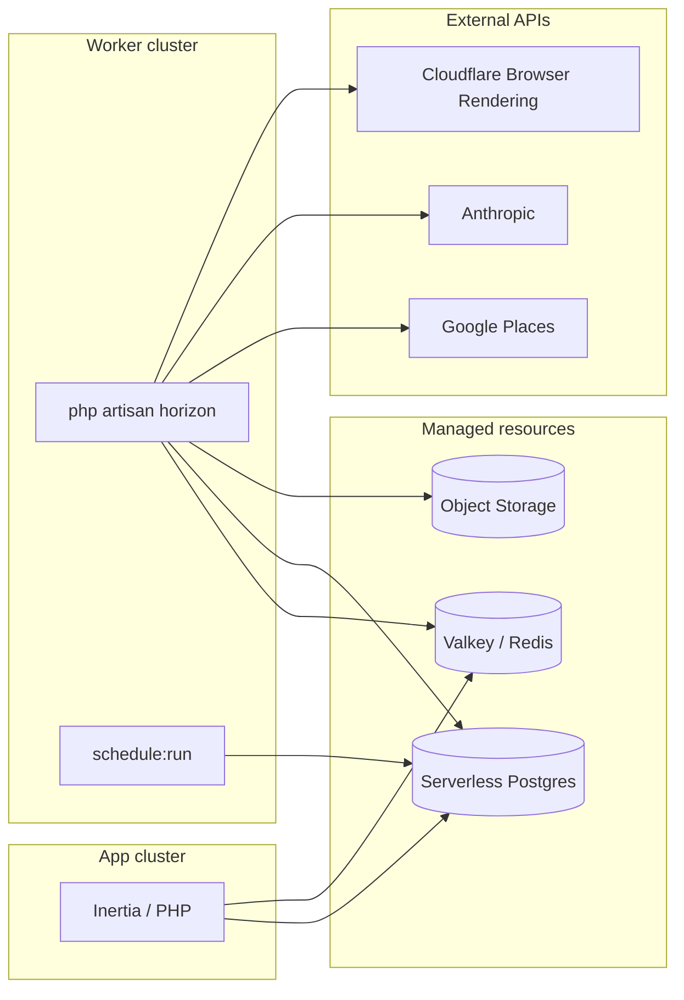
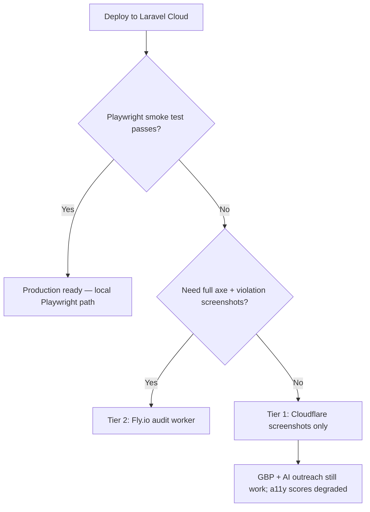

# Laravel Cloud deployment guide

Deploy checklist and audit fallback plan for the nthdesigns prospect scanner.

---

## Architecture on Cloud



| Workload | Where it runs |
|----------|---------------|
| Web UI, auth, settings | App cluster |
| `scraping` queue (Places, scoring) | Worker cluster via Horizon |
| `auditing` queue (audit, screenshots, reports) | Worker cluster via Horizon |
| Daily `scanner:purge-expired` | Scheduler on App or Worker cluster |
| Report / violation images | Laravel Object Storage (R2) |

---

## Pre-flight checklist

Before connecting the repo to Laravel Cloud:

- [ ] App uses PostgreSQL locally (Cloud does not support SQLite in production)
- [ ] `composer.json` / `composer.lock` committed
- [ ] `package-lock.json` committed (root + `scripts/`)
- [ ] Google Places API key with Places API (New) enabled
- [ ] Anthropic API key
- [ ] Cloudflare account (optional now, needed for Browser Rendering fallback)
- [ ] First admin user seeder or registration flow ready
- [ ] Horizon gate: add your email in `app/Providers/HorizonServiceProvider.php` before production deploy

---

## 1. Create resources (infrastructure canvas)

Attach these to your production environment:

| Resource | Purpose |
|----------|---------|
| **Serverless Postgres** | Primary database |
| **Laravel Valkey** (or Redis by Upstash) | Queue + cache + sessions |
| **Laravel Object Storage** | Report and violation screenshots |

### Object storage

1. Create a bucket (type: Laravel Object Storage).
2. Attach it to the environment.
3. Cloud injects `AWS_*` vars automatically — do not override unless you know why.

Set in environment variables:

```env
REPORTS_DISK=s3
```

The settings page storage health check writes a temp file to this disk on save.

---

## 2. Compute clusters

### App cluster

- **Purpose:** HTTP traffic only (or HTTP + scheduler if you prefer)
- **PHP:** 8.4 (or 8.3)
- **Node:** 22 or 24 (used during build; may also be available at runtime)
- **Hibernation:** Off for production (hibernating envs stop workers and scheduler)
- **Scheduler:** Enable if not running scheduler on worker cluster
- **HTTP basic auth:** Optional on staging

Suggested size: 1 GB RAM minimum for a single-operator tool.

### Worker cluster (recommended)

- **Purpose:** Horizon + heavy audit jobs
- **Size:** 2 GB RAM minimum if running Playwright locally; 4 GB if running multiple auditing workers
- **Background processes:** see section 4

Keep auditing off the App cluster so 90–150s browser jobs do not compete with page loads.

---

## 3. Build and deploy commands

Configure in **Settings → Deployments**.

### Build commands

Cloud runs npm for the Laravel frontend by default. Extend with audit script dependencies:

```bash
composer install --no-dev --optimize-autoloader

npm ci
npm run build

cd scripts
npm ci
npx playwright install chromium --with-deps
cd ..

php artisan optimize
```

> Build timeout is 15 minutes. Playwright browser install can take several minutes — that is normal.

If Cloud's default `npm ci && npm run build` is already present, merge rather than duplicate:

```bash
composer install --no-dev --optimize-autoloader
npm ci && npm run build
cd scripts && npm ci && npx playwright install chromium --with-deps && cd ..
php artisan optimize
```

### Deploy commands

```bash
php artisan migrate --force
```

Do **not** add:

- `php artisan storage:link` — ephemeral filesystem; use object storage
- `php artisan queue:restart` / `horizon:terminate` — Cloud handles this
- `php artisan optimize:clear` — clears caches unexpectedly

---

## 4. Background processes

On the **Worker cluster**, add:

| Process | Command |
|---------|---------|
| Horizon | `php artisan horizon` |

On **App cluster** or **Worker cluster** (one only):

| Process | Setting |
|---------|---------|
| Scheduler | Enable **Scheduler** toggle |

Scheduled task already registered:

```php
Schedule::command('scanner:purge-expired')->daily();
```

If you scale to multiple App/Worker replicas, add `->onOneServer()` to that schedule entry.

---

## 5. Environment variables

Set these in **Settings → Environment variables**. Re-deploy after changes.

### Application

```env
APP_NAME="nthdesigns Scanner"
APP_ENV=production
APP_DEBUG=false
APP_URL=https://your-domain.laravel.cloud
```

Generate `APP_KEY` locally (`php artisan key:generate --show`) or let Cloud inject on first deploy.

### Database

Cloud injects Postgres credentials when the resource is attached. Verify:

```env
DB_CONNECTION=pgsql
```

### Queue, cache, session

```env
QUEUE_CONNECTION=redis
CACHE_STORE=redis
SESSION_DRIVER=redis
```

Cloud injects Redis/Valkey host, password, and port when cache is attached.

### Storage

After attaching Object Storage:

```env
REPORTS_DISK=s3
```

Cloud sets `AWS_ACCESS_KEY_ID`, `AWS_SECRET_ACCESS_KEY`, `AWS_BUCKET`, `AWS_ENDPOINT`, etc.

### Scanner APIs

```env
GOOGLE_PLACES_API_KEY=
ANTHROPIC_API_KEY=
ANTHROPIC_MODEL=claude-sonnet-4-20250514
```

### Scanner behaviour

```env
HORIZON_PREFIX=nth-scanner
REPORT_BOOKING_URL=https://tidycal.com/yourhandle
REPORT_EXPIRY_DAYS=30
SEARCH_RATE_LIMIT_SECONDS=30
AUDIT_TIMEOUT=120
```

### Node / audit scripts (Playwright path)

```env
NODE_BINARY=node
AUDIT_SCRIPT_PATH=
LIGHTHOUSE_BINARY=lighthouse
```

Leave `AUDIT_SCRIPT_PATH` empty to use `scripts/audit.js` from project root.

Lighthouse is optional — audits still run without it; performance/SEO scores will be null.

### Cloudflare Browser Rendering (fallback path)

Only needed if Playwright fails on Cloud or you skip local browser install:

```env
AUDIT_DRIVER=cloudflare
CLOUDFLARE_API_TOKEN=
CLOUDFLARE_ACCOUNT_ID=
```

See [Fallback: Cloudflare Browser Rendering](#fallback-cloudflare-browser-rendering) below.

---

## 6. Post-deploy verification

Run these from the Cloud **Commands** tab after the first successful deploy.

### Core app

```bash
php artisan migrate:status
php artisan horizon:status
php artisan schedule:list
```

### Node availability

```bash
which node && node --version
ls -la scripts/node_modules/.cache/ms-playwright 2>/dev/null || ls scripts/node_modules/playwright
```

### Playwright smoke test

```bash
mkdir -p /tmp/audit-test
node scripts/audit.js https://example.com /tmp/audit-test
echo "exit: $?"
ls -la /tmp/audit-test
```

**Success:** JSON on stdout, exit code 0, optional PNG files in `/tmp/audit-test`.

**Failure:** note the stderr — common causes are missing Chromium, sandbox errors, or `node` not on PATH.

### Screenshot smoke test

```bash
mkdir -p /tmp/ss-test
node scripts/screenshot.js https://example.com /tmp/ss-test
ls -la /tmp/ss-test
```

### End-to-end in the app

1. Log in, open **Settings** — all three health checks green (Places, Anthropic, storage).
2. Run a small search (1–2 results).
3. Wait for pipeline: scoring → audit → combine → report → screenshot.
4. Open prospect detail and public report link — verify grade, violations, desktop screenshot.
5. Open `/horizon` while logged in — confirm `scraping` and `auditing` supervisors processing jobs.

---

## 7. Playwright on Cloud — if smoke tests fail

Try these before switching to the Cloudflare fallback.

### A. Add container-safe Chromium flags

Update `scripts/audit.js` and `scripts/screenshot.js`:

```js
const browser = await chromium.launch({
    headless: true,
    args: ['--no-sandbox', '--disable-setuid-sandbox', '--disable-dev-shm-usage'],
});
```

Redeploy and re-run the smoke test.

### B. Confirm NODE_BINARY path

```bash
which node
```

Set `NODE_BINARY` to the full path if `node` is not on the default PATH for queue workers.

### C. Increase worker memory

Horizon auditing supervisor is configured for 512 MB per process. Playwright often needs more:

- Worker cluster: 2–4 GB RAM
- In `config/horizon.php` production `auditing-supervisor`: consider `memory => 768` and `maxProcesses => 1` on smaller instances

### D. Reduce parallelism

On a 2 GB worker, run one auditing process at a time:

```php
'maxProcesses' => 1,
'minProcesses' => 1,
```

### E. Skip Lighthouse

Do not install Lighthouse in build commands unless you need it — Playwright + axe is the critical path.

---

## 8. Operational notes

### Ephemeral disk

- Temp audit files live under `storage/app/temp/` and are deleted after upload.
- Do not rely on `storage/app/public` persisting — always use `REPORTS_DISK=s3` in production.

### Failed audits

Prospects with websites show `audit_status: failed` when Playwright fails. GBP scoring and reports for no-website prospects still work. Check Horizon failed jobs and Cloud logs.

### Rate limiting

Search is limited to one search per user every 30 seconds (`SEARCH_RATE_LIMIT_SECONDS`). Adjust via env if needed.

### Purge job

`scanner:purge-expired` runs daily. Requires scheduler enabled. Purges expired report payloads per `REPORT_EXPIRY_DAYS`.

### Horizon access

`/horizon` requires an authenticated user. Restrict further by adding your email to the `viewHorizon` gate in `HorizonServiceProvider`.

### Staging

Replicate production environment in Cloud, attach separate logical DB schema, enable HTTP basic auth, use a smaller worker or `QUEUE_CONNECTION=sync` only for UI testing without audits.

---

## Fallback: Cloudflare Browser Rendering

Use this if Playwright cannot run reliably on Laravel Cloud workers.

Laravel Cloud's own docs recommend Cloudflare for browser tasks ([Generating PDFs](https://cloud.laravel.com/docs/knowledge-base/generating-pdfs)) because runtime instances are PHP-oriented and do not ship with Chrome.

### What Cloudflare can replace

| Feature | Cloudflare API | Notes |
|---------|----------------|-------|
| Desktop report screenshot | `POST /browser-rendering/screenshot` | Direct replacement for `CaptureScreenshotJob` |
| Full-page capture | Same endpoint + `screenshotOptions.fullPage` | Optional |
| HTML snapshot | `POST /browser-rendering/snapshot` | Returns HTML + base64 screenshot |

### What Cloudflare cannot drop in easily

| Feature | Challenge |
|---------|-----------|
| axe-core WCAG violation scan | No built-in a11y API — needs custom script injection + result extraction |
| Per-violation element screenshots | Requires axe selectors + clipped screenshots; doable but non-trivial |
| Lighthouse performance/SEO scores | Not available via Browser Rendering — keep optional or use PageSpeed Insights API |

### Recommended fallback tiers

#### Tier 1 — Screenshots only (fastest)

**Scope:** ~1 day of work.

- Add `CloudflareBrowserService` wrapping the screenshot endpoint.
- Switch `CaptureScreenshotJob` to call Cloudflare when `AUDIT_DRIVER=cloudflare`.
- Leave `AuditSiteJob` on Playwright if it works; otherwise mark audits as skipped/degraded.

**Env:**

```env
AUDIT_DRIVER=cloudflare
CLOUDFLARE_API_TOKEN=   # Account.Browser Rendering permission
CLOUDFLARE_ACCOUNT_ID=
```

**Screenshot request shape:**

```php
Http::withToken(config('services.cloudflare.api_token'))
    ->post(
        'https://api.cloudflare.com/client/v4/accounts/'
        .config('services.cloudflare.account_id')
        .'/browser-rendering/screenshot',
        [
            'url' => $url,
            'viewport' => ['width' => 1280, 'height' => 800],
            'gotoOptions' => [
                'waitUntil' => 'networkidle0',
                'timeout' => 45000,
            ],
        ],
    );
```

Response body is raw PNG bytes — write to temp file, upload via existing `ScreenshotStorageService`.

#### Tier 2 — External Playwright worker (full parity)

**Scope:** ~2–3 days.

Run Playwright on a platform that supports browsers (Fly.io, Render, Railway):

```
Laravel Cloud worker                    Fly.io audit service
─────────────────────                   ────────────────────
AuditSiteJob ──HTTP POST /audit──►      node scripts/audit.js (always works)
         ◄── JSON payload ──────        Playwright + axe + Lighthouse
CaptureScreenshotJob ──HTTP──►         or separate /screenshot route
```

**Benefits:**

- No change to audit logic — reuse `scripts/audit.js` as-is
- Cloud workers stay lightweight PHP-only
- Scale audit service independently

**Implementation sketch:**

1. Add `config('scanner.audit_service_url')` and `AUDIT_SERVICE_TOKEN`.
2. Replace `Process::run([node, ...])` in `AuditSiteJob` with `Http::timeout(150)->post(...)`.
3. Deploy `scripts/` as a minimal Node Docker image on Fly.io with 1–2 GB RAM.
4. Authenticate with a shared bearer token.

#### Tier 3 — Cloudflare for audits (partial)

**Scope:** ~3–5 days; reduced fidelity.

- Use `/snapshot` with `addScriptTag` to inject axe-core from CDN.
- Run axe in-page; encode results into a hidden DOM node or `window.__auditResults`.
- Fetch rendered HTML and parse results — fragile compared to Playwright.
- Skip per-violation screenshots in v1.
- Skip Lighthouse entirely or add Google PageSpeed Insights API separately.

Only choose this if you want zero extra infrastructure and can accept a simpler a11y signal.

### Suggested decision flow



### Config additions for fallback (when implemented)

Add to `config/services.php`:

```php
'cloudflare' => [
    'api_token'  => env('CLOUDFLARE_API_TOKEN'),
    'account_id' => env('CLOUDFLARE_ACCOUNT_ID'),
],
```

Add to `config/scanner.php`:

```php
'audit_driver' => env('AUDIT_DRIVER', 'playwright'), // playwright | cloudflare | http
'audit_service_url' => env('AUDIT_SERVICE_URL'),
'audit_service_token' => env('AUDIT_SERVICE_TOKEN'),
```

Branch in `AuditSiteJob::handle()` and `ScreenshotCaptureService` on `audit_driver` / `screenshot_driver` — **implemented**.

### Laravel Cloud quick start

```env
AUDIT_DRIVER=cloudflare
CLOUDFLARE_API_TOKEN=
CLOUDFLARE_ACCOUNT_ID=
REPORTS_DISK=s3
```

Or for full audits via external worker:

```env
AUDIT_DRIVER=http
AUDIT_SERVICE_URL=https://your-audit-worker.fly.dev
AUDIT_SERVICE_TOKEN=
SCREENSHOT_DRIVER=cloudflare
```

---

## Quick reference — production env template

```env
APP_ENV=production
APP_DEBUG=false
APP_URL=https://scanner.example.com

DB_CONNECTION=pgsql

QUEUE_CONNECTION=redis
CACHE_STORE=redis
SESSION_DRIVER=redis

REPORTS_DISK=s3

GOOGLE_PLACES_API_KEY=
ANTHROPIC_API_KEY=
ANTHROPIC_MODEL=claude-sonnet-4-20250514

HORIZON_PREFIX=nth-scanner
REPORT_BOOKING_URL=
REPORT_EXPIRY_DAYS=30
SEARCH_RATE_LIMIT_SECONDS=30
AUDIT_TIMEOUT=120

NODE_BINARY=node

# Fallback (optional)
# AUDIT_DRIVER=cloudflare
# CLOUDFLARE_API_TOKEN=
# CLOUDFLARE_ACCOUNT_ID=
```

---

## Related docs

- [Laravel Cloud environments](https://cloud.laravel.com/docs/environments) — build commands, Node version, ephemeral filesystem
- [Laravel Cloud queues](https://cloud.laravel.com/docs/queues) — worker clusters, Horizon
- [Laravel Object Storage](https://cloud.laravel.com/docs/resources/object-storage) — R2 bucket setup
- [Cloudflare Browser Rendering — screenshot](https://developers.cloudflare.com/browser-rendering/rest-api/screenshot-endpoint/)
