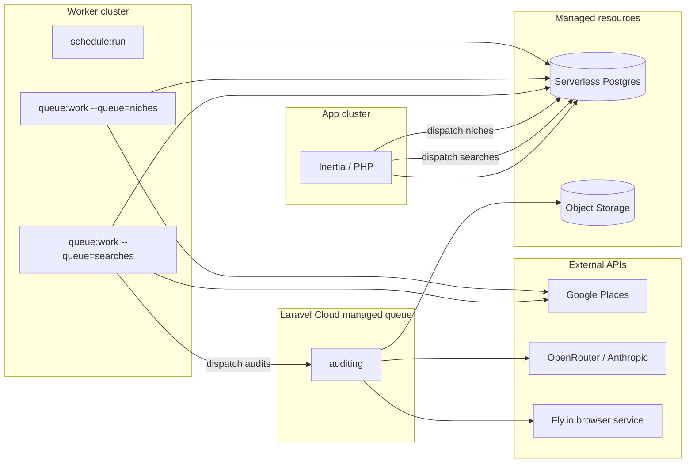
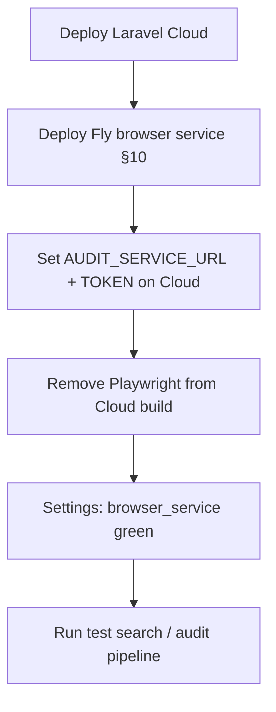

# Laravel Cloud deployment guide

Deploy checklist for the nthdesigns prospect scanner, including browser automation options and costs on Laravel Cloud.

---

## Architecture on Cloud



| Workload | Queue name | Where it runs |
|----------|------------|---------------|
| Web UI, auth, settings | — | App cluster |
| Operator searches (Places discovery + scoring) | `searches` | Worker: `queue:work database --queue=searches` |
| Batch niche scans (`niches:scan`, sample backfill) | `niches` | Worker: `queue:work database --queue=niches` |
| Audits, combine scores, reports, screenshots, outreach | `auditing` | Laravel Cloud **managed queue** (hybrid) or database worker |
| Daily `scanner:purge-expired` | — | Scheduler on App or Worker cluster |
| Weekly `niches:scan` (Monday 06:00 London) | dispatches to `niches` | Scheduler |
| Report / violation images | — | Laravel Object Storage (R2) |

**Queue driver:** production uses `QUEUE_CONNECTION=database` (not Redis). Horizon is not used — it only supports the Redis driver. Run `php artisan queue:work` on the worker cluster instead.

See [§4 Queue architecture](#4-background-processes) for job routing, worker commands, env vars, and troubleshooting stuck searches.

---

## Pre-flight checklist

Before connecting the repo to Laravel Cloud:

- [ ] App uses PostgreSQL locally (Cloud does not support SQLite in production)
- [ ] `composer.json` / `composer.lock` committed
- [ ] `package-lock.json` committed (root + `scripts/`)
- [ ] Google Places API key with Places API (New) enabled
- [ ] OpenRouter API key (Anthropic models)
- [ ] Cloudflare account (optional now, needed for Browser Rendering fallback)
- [ ] First admin user seeder or registration flow ready
- [ ] `jobs` and `failed_jobs` tables migrated (`php artisan migrate` includes them)

---

## 1. Create resources (infrastructure canvas)

Attach these to your production environment:

| Resource | Purpose |
|----------|---------|
| **Serverless Postgres** | Primary database **and** queue (`jobs` table) |
| **Laravel Object Storage** | Report and violation screenshots |

**Optional:** Laravel Valkey / Redis — only if you switch cache or sessions off the database driver. Not required for queues with `QUEUE_CONNECTION=database`.

### Object storage

1. Create a bucket (type: Laravel Object Storage).
2. Attach it to the environment.
3. Cloud injects `AWS_*` vars automatically — do not override unless you know why.

Set in environment variables:

```env
REPORTS_DISK=s3
```

The settings page storage health check writes a temp file to this disk on save.

---

## 2. Compute clusters

### App cluster

- **Purpose:** HTTP traffic only (or HTTP + scheduler if you prefer)
- **PHP:** 8.4 (or 8.3)
- **Node:** 22 or 24 (used during build; may also be available at runtime)
- **Hibernation:** Off for production (hibernating envs stop workers and scheduler)
- **Scheduler:** Enable if not running scheduler on worker cluster
- **HTTP basic auth:** Optional on staging

Suggested size: 1 GB RAM minimum for a single-operator tool.

### Worker cluster (recommended)

- **Purpose:** `queue:work` for `searches` and `niches` (Places API jobs); scheduler optional
- **Size:** 1 GB RAM sufficient when audits run on Fly.io / managed `auditing` queue (no Playwright on Cloud workers)
- **Background processes:** two workers recommended — `--queue=searches` and `--queue=niches` (see [§4 Queue overview](#queue-overview))

Keep auditing off the App cluster so long browser jobs do not compete with page loads. With hybrid setup, Cloud managed workers handle `auditing`; your worker cluster only drains `searches` and `niches`.

---

## 3. Build and deploy commands

Configure in **Settings → Deployments**.

### Build commands

**Production (Fly.io for browsers):** do **not** install Playwright on Laravel Cloud — use the minimal build in [§10 step 5](#5-trim-laravel-cloud-build-commands).

**Local / Herd only** — optional Playwright in Cloud build (not recommended; runtime still fails with missing OS libraries):

```bash
composer install --no-dev --optimize-autoloader
npm ci && npm run build
# Skip the block below when using Fly.io (§10)
mkdir -p storage/app/playwright-browsers && cd scripts && npm ci && PLAYWRIGHT_BROWSERS_PATH="$PWD/../storage/app/playwright-browsers" npx playwright install chromium && cd ..
php artisan optimize
```

> **Do not use `--with-deps` on Laravel Cloud.** That flag runs `playwright install-deps`, which calls `su` to install apt packages. Build containers are non-root, so you get `su: Authentication failure` and the deploy fails.
>
> Build timeout is 15 minutes.

### Deploy commands

```bash
php artisan migrate --force
```

Do **not** add:

- `php artisan storage:link` — ephemeral filesystem; use object storage
- `php artisan optimize:clear` — clears caches unexpectedly

`php artisan optimize` caches config at **build** time. `AUDIT_SERVICE_URL` is applied again at **runtime** via `App\Support\ScannerConfig` so managed `auditing` workers use Fly HTTP even when the cached config still says `playwright`.

---

## 4. Background processes

### Queue overview

The app uses **three named queues** so operator searches are not blocked by batch niche scanning. All three can share the same Postgres `jobs` table (`QUEUE_CONNECTION=database`); queue **names** (`searches`, `niches`, `auditing`) route work to the correct workers.

#### Why separate `searches` and `niches`?

| Path | Trigger | Volume | Latency expectation |
|------|---------|--------|---------------------|
| **Operator search** (`/search`) | User submits niche + city | 1 job → N `ScorePlaceJob`s | Seconds — UI shows **Queued** until `ScrapeProspectsJob` starts |
| **Niche scan** (`/niches` → Scan, or weekly schedule) | Manual or cron | ~53 niches × ~119 cities ≈ **6,000+** `ScanNicheJob`s | Hours — batch throughput is fine |

Previously both paths used a single `scraping` queue. A full niche scan could backlog hundreds of jobs and leave recent searches stuck in **Queued** for hours even though the queue worker was healthy.

#### Job routing

| Queue | Jobs | PHP helper | Connection config |
|-------|------|------------|-------------------|
| `searches` | `ScrapeProspectsJob`, `ScorePlaceJob` | `App\Support\SearchQueue` | `config('scanner.search_queue_connection')` ← `SEARCH_QUEUE_CONNECTION` |
| `niches` | `ScanNicheJob` | `App\Support\NicheQueue` | `config('scanner.niche_queue_connection')` ← `NICHE_QUEUE_CONNECTION` |
| `auditing` | `AuditSiteJob`, `CombineScoresJob`, `GenerateProspectReportJob`, `CaptureScreenshotJob`, `GenerateOutreachEmailJob` | `App\Support\AuditingQueue` | `config('scanner.auditing_queue_connection')` ← `AUDITING_QUEUE_CONNECTION` |

**Search pipeline (simplified):**

```text
POST /searches
  → ScrapeProspectsJob          [searches]
  → ScorePlaceJob × N           [searches]
  → AuditSiteJob                [auditing]   (when scan type needs a11y audit)
  → CombineScoresJob            [auditing]
  → GenerateProspectReportJob   [auditing]
  → CaptureScreenshotJob        [auditing]
```

**Niche pipeline:**

```text
niches:scan / POST /niches/scan / sample panel backfill
  → ScanNicheJob × (niches × cities)   [niches]
  → writes niche_scans aggregates (no Search record)
```

#### Environment variables (queue routing)

| Variable | Typical production value | Purpose |
|----------|-------------------------|---------|
| `QUEUE_CONNECTION` | `database` | Default connection; Postgres `jobs` table |
| `SEARCH_QUEUE_CONNECTION` | `database` | Where operator search jobs are stored |
| `NICHE_QUEUE_CONNECTION` | `database` | Where batch niche scan jobs are stored |
| `AUDITING_QUEUE_CONNECTION` | `cloud` (hybrid) or `database` | Audit/report pipeline |
| `DB_QUEUE_RETRY_AFTER` | `200`–`250` | Must exceed longest database-queue job timeout (audit: 210s) |
| `SCRAPING_QUEUE_CONNECTION` | *(deprecated)* | Fallback for `NICHE_QUEUE_CONNECTION` on older envs |

#### Worker commands (summary)

| Deployment | Search worker | Niche worker | Auditing |
|------------|---------------|--------------|----------|
| **Hybrid (recommended)** | `--queue=searches` on worker cluster | `--queue=niches` on worker cluster | Managed queue `auditing` — no `queue:work` |
| **All database** | Single worker: `--queue=searches,niches,auditing` (`searches` listed first) | *(same process)* | *(same process)* |

Niche worker uses `--sleep=5` (vs `3` for searches) so a busy niche batch yields slightly more often; with **separate processes**, search jobs are not delayed by niche backlog regardless.

#### Monitoring

```bash
php artisan queue:monitor searches niches auditing
```

Inspect Postgres backlog by queue name:

```bash
php artisan tinker --execute="
foreach (['searches','niches','scraping','auditing'] as \$q) {
    echo \$q.': '.DB::table('jobs')->where('queue', \$q)->count().PHP_EOL;
}
"
```

Healthy hybrid production: `searches` near 0 after a test search; `niches` may be large during a full scan; `scraping` should be **0** (legacy queue name); `auditing` visible in Cloud **Queues** tab, not necessarily in Postgres.

Job mix in pending work:

```bash
php artisan tinker --execute="
\$rows = DB::table('jobs')->select('queue', DB::raw('count(*) as c'))->groupBy('queue')->get();
print_r(\$rows->toArray());
"
```

#### Troubleshooting: recent searches stuck in **Queued**

In the UI, **Queued** = `searches.status = pending` — `ScrapeProspectsJob` has not started yet.

| Symptom | Likely cause | Fix |
|---------|--------------|-----|
| `queue:monitor` shows large `niches` backlog, `searches` also pending | Old single `scraping` worker, or only one worker draining `niches` first | Deploy separate search + niche workers (Option A below) |
| Pending jobs on queue `scraping` | Pre-migration jobs; no worker listens to `scraping` anymore | `php artisan queue:clear database --queue=scraping` then re-submit stuck searches |
| `searches` pending, **no** search worker process | Background process missing or wrong `--queue` | Add `queue:work database --queue=searches …` on worker cluster |
| Jobs in `failed_jobs` | Places API, config, or timeout | `php artisan queue:failed` → inspect exception |
| Search stuck **Discovering** / **Auditing** | Different issue — search job started; check `auditing` queue and Fly browser service | See [§6 Post-deploy verification](#6-post-deploy-verification) |

Re-submit a stuck search after clearing legacy jobs: open `/search` and run again, or from Commands:

```bash
php artisan tinker --execute="
\$s = App\Models\Search::where('status','pending')->latest()->first();
if (\$s) { App\Jobs\ScrapeProspectsJob::dispatch(\$s); echo 'dispatched search '.\$s->id.PHP_EOL; }
"
```

#### Migrating from the old `scraping` queue

If you deployed before the `searches` / `niches` split:

1. Deploy current code.
2. **Replace** background process `--queue=scraping` with the search + niche workers in [Option A](#option-a--hybrid-recommended-on-starter-managed-auditing--database-searches--niches) (or the combined command in [Option B](#option-b--all-jobs-on-database-queue)).
3. Clear stale jobs (they will never run — no worker listens to `scraping`):

   ```bash
   php artisan queue:clear database --queue=scraping
   ```

4. Re-submit searches stuck in **Queued** (`searches.status = pending`).
5. Confirm: `php artisan queue:monitor searches niches auditing` — `scraping` size should stay 0.

---

### Option A — Hybrid (recommended on Starter): managed `auditing` + database `searches` / `niches`

Use a **Managed queue** named `auditing` for Playwright audits (Cloud scales workers). Keep **searches** and **niches** on the Postgres `jobs` table with separate background workers so operator searches are not blocked by batch niche scans.

**Canvas**

1. **New managed queue** → queue name: `auditing` (must match exactly).
2. Do **not** mark it as the environment default queue.
3. Instance size: **2 GiB** minimum for Playwright (Growth plan tiers); raise **visibility timeout** to **240s** and request a **shutdown timeout** above 210s if audits are cut off mid-run.
4. App or worker cluster → **Background processes** → add:

| Process | Command |
|---------|---------|
| Search worker | `php artisan queue:work database --queue=searches --timeout=90 --tries=3 --sleep=3` |
| Niche worker | `php artisan queue:work database --queue=niches --timeout=90 --tries=3 --sleep=5` |

Cloud runs managed workers for `auditing` — do **not** add a `queue:work` process for `auditing`.

**Env**

```env
QUEUE_CONNECTION=database
SEARCH_QUEUE_CONNECTION=database
NICHE_QUEUE_CONNECTION=database
AUDITING_QUEUE_CONNECTION=cloud
DB_QUEUE_RETRY_AFTER=200
```

`SCRAPING_QUEUE_CONNECTION` is a deprecated alias for `NICHE_QUEUE_CONNECTION` on existing deployments.

Laravel Cloud provisions a **`cloud` queue connection** at runtime (via `LARAVEL_CLOUD_MANAGED_QUEUES_CONFIG` on the server). Use **`cloud`**, not **`sqs`**. The stock `sqs` connection in `config/queue.php` is only for self-managed AWS credentials and will show placeholder `your-account-id` / `us-east-1` values if you point auditing at it on Cloud.

**Requirements:** `aws/aws-sdk-php` in `composer.json` (deploy fails without it). Laravel **13.11.2+** for managed-queue support.

**Verify:** run a search → it leaves **Queued** within seconds even when the `niches` queue is backlogged; Cloud **Queues** tab shows `auditing` jobs processing; Postgres `jobs` table contains `searches` and/or `niches` rows (not `scraping`).

See also [Queue overview](#queue-overview) and [Troubleshooting: recent searches stuck in Queued](#troubleshooting-recent-searches-stuck-in-queued).

#### Managed queue: `InvalidAddress` / `sqs.us-east-1.amazonaws.com/` is not valid

This error almost always means auditing jobs use the **`sqs` connection** instead of Laravel Cloud’s **`cloud` connection**. The app then posts to the placeholder URL from `config/queue.php` (`https://sqs.us-east-1.amazonaws.com/your-account-id`), not to your managed queue in `eu-west-2`.

**Fix (most common)**

```env
AUDITING_QUEUE_CONNECTION=cloud
```

Set on **app and worker**, then **Save & deploy**. Do **not** use `sqs` for Laravel Cloud managed queues.

**Diagnose** (Cloud Commands):

```bash
php artisan tinker --execute="
echo 'managed flag: '.env('LARAVEL_CLOUD_MANAGED_QUEUES').PHP_EOL;
echo 'auditing connection: '.config('scanner.auditing_queue_connection').PHP_EOL;
echo 'has cloud config: '.(isset(\$_SERVER['LARAVEL_CLOUD_MANAGED_QUEUES_CONFIG']) ? 'yes' : 'no').PHP_EOL;
print_r(config('queue.connections.cloud'));
print_r(config('queue.connections.sqs'));
"
```

Healthy output:

- `auditing connection: cloud`
- `has cloud config: yes`
- `queue.connections.cloud` has `driver => cloud` and a nested `connection` array (region `eu-west-2`, credentials, queue URLs)
- `queue.connections.sqs` may still show `your-account-id` — that is fine if auditing does not use it

**Other causes**

1. **Managed queue not provisioned** — canvas → **New managed queue** named exactly `auditing`, then **Save & deploy**.
2. **`LARAVEL_CLOUD_MANAGED_QUEUES_CONFIG` missing** after deploy — redeploy; confirm Laravel **13.11.2+** and `aws/aws-sdk-php` in `composer.json`.
3. **Manual `SQS_*` / `AWS_*` env vars** — remove them; they do not configure managed queues and can confuse debugging.

**Fix checklist**

1. `AUDITING_QUEUE_CONNECTION=cloud` on app + worker.
2. Canvas → managed queue named **`auditing`** (one name per queue; not comma-separated).
3. **Save & deploy**.
4. Managed queue **visibility timeout** ≥ **240s** (audit jobs timeout at 210s).

**Temporary workaround** (until `cloud` works): process auditing on the database queue:

```env
AUDITING_QUEUE_CONNECTION=database
```

```bash
php artisan queue:work database --queue=auditing --timeout=270 --tries=3 --stop-when-empty
```

Then switch back to `cloud`.

### Option B — All jobs on database queue

On the **app** or **worker** cluster, add one background process:

| Process | Command |
|---------|---------|
| Queue worker | `php artisan queue:work database --queue=searches,niches,auditing --timeout=270 --tries=3 --sleep=3 --max-jobs=50` |

List **`searches` first** so a single worker prefers operator searches when multiple queues have pending jobs.

**Env:**

```env
QUEUE_CONNECTION=database
SEARCH_QUEUE_CONNECTION=database
NICHE_QUEUE_CONNECTION=database
AUDITING_QUEUE_CONNECTION=database
DB_QUEUE_RETRY_AFTER=250
```

- **`--timeout=270`** — must exceed `AuditSiteJob` timeout (240s).
- **`--max-jobs=50`** — restarts the worker periodically to release memory after Playwright runs.

For production with Fly.io audits, **Option A (hybrid)** is still preferred so long-running audit work does not share a database worker with Places API jobs.

### Option C — Horizon (Redis)

Attach **Cache** (Valkey), set `QUEUE_CONNECTION=redis`, run `php artisan horizon` as a custom background process. See [Optional: Redis + Horizon](#optional-redis--horizon) below.

Do **not** run Horizon unless `QUEUE_CONNECTION=redis`.

On **App cluster** or **Worker cluster** (one only):

| Process | Setting |
|---------|---------|
| Scheduler | Enable **Scheduler** toggle |

Scheduled task already registered:

```php
Schedule::command('scanner:purge-expired')->daily();
```

If you scale to multiple App/Worker replicas, add `->onOneServer()` to that schedule entry.

---

## 5. Environment variables

Set these in **Settings → Environment variables**. Re-deploy after changes.

### Application

```env
APP_NAME="nthdesigns Scanner"
APP_ENV=production
APP_DEBUG=false
APP_URL=https://your-domain.laravel.cloud
```

Generate `APP_KEY` locally (`php artisan key:generate --show`) or let Cloud inject on first deploy.

### Database

Cloud injects Postgres credentials when the resource is attached. Verify:

```env
DB_CONNECTION=pgsql
```

### Queue, cache, session

See [§4 Queue overview](#queue-overview) for job routing, worker commands, and troubleshooting.

**Hybrid (managed auditing + database searches/niches):**

```env
QUEUE_CONNECTION=database
SEARCH_QUEUE_CONNECTION=database
NICHE_QUEUE_CONNECTION=database
AUDITING_QUEUE_CONNECTION=cloud
DB_QUEUE_RETRY_AFTER=200

CACHE_STORE=database
SESSION_DRIVER=database
```

**All database queues:**

```env
QUEUE_CONNECTION=database
SEARCH_QUEUE_CONNECTION=database
NICHE_QUEUE_CONNECTION=database
AUDITING_QUEUE_CONNECTION=database
DB_QUEUE_RETRY_AFTER=250

CACHE_STORE=database
SESSION_DRIVER=database
```

- **`SEARCH_QUEUE_CONNECTION`** — Postgres table for `ScrapeProspectsJob` and `ScorePlaceJob` (`searches` queue).
- **`NICHE_QUEUE_CONNECTION`** — Postgres table for `ScanNicheJob` (`niches` queue). `SCRAPING_QUEUE_CONNECTION` is a deprecated alias.
- **`DB_QUEUE_RETRY_AFTER=250`** — must exceed audit job timeout (240s) when searches/niches/auditing use the database driver.
- **`AUDITING_QUEUE_CONNECTION=cloud`** — sends `AuditSiteJob`, reports, screenshots, and outreach jobs to the managed queue named `auditing` via Laravel Cloud’s `cloud` driver (see [Managed queue troubleshooting](#managed-queue-invalidaddress--sqsus-east-1amazonawscom-is-not-valid)).

- **Do not use `sqs`** for auditing on Laravel Cloud unless you supply your own AWS queue URLs and credentials. Managed queues use **`cloud`** only.

Redis/Valkey is optional unless you use Horizon.

### Storage

After attaching Object Storage:

```env
REPORTS_DISK=s3
```

Cloud sets `AWS_ACCESS_KEY_ID`, `AWS_SECRET_ACCESS_KEY`, `AWS_BUCKET`, `AWS_ENDPOINT`, etc.

### Scanner APIs

```env
GOOGLE_PLACES_API_KEY=
OPENROUTER_API_KEY=
OPENROUTER_MODEL=anthropic/claude-sonnet-4
```

### Scanner behaviour

```env
REPORT_BOOKING_URL=https://tidycal.com/yourhandle
REPORT_EXPIRY_DAYS=30
SEARCH_RATE_LIMIT_SECONDS=30
AUDIT_TIMEOUT=210
SCREENSHOT_TIMEOUT=120
```

`AUDIT_TIMEOUT` is the Laravel HTTP client timeout for `POST {AUDIT_SERVICE_URL}/audit`. A full Fly audit (axe + Lighthouse + optional PageSpeed fallback) typically takes **90–180s**; keep this at **210s** unless smoke tests on slow URLs prove insufficient. Must stay below `AuditSiteJob` timeout (240s).

### Node / audit scripts (Playwright path)

```env
NODE_BINARY=node
AUDIT_SCRIPT_PATH=
LIGHTHOUSE_BINARY=lighthouse
```

When the build installs Chromium to `storage/app/playwright-browsers` (recommended below), leave `PLAYWRIGHT_BROWSERS_PATH` unset. Optional override: `PLAYWRIGHT_BROWSERS_PATH=0` if you install under `scripts/node_modules` instead.

Leave `AUDIT_SCRIPT_PATH` empty to use `scripts/audit.js` from project root.

Lighthouse is optional for **local** Playwright audits — install the npm package and set `LIGHTHOUSE_BINARY` if you want performance scores in dev. On **production Fly**, Lighthouse is installed by default (see §10).

### Browser automation (production — Fly.io)

Laravel Cloud workers **cannot run Playwright**. Use a [Fly.io browser service](#10-deploy-the-flyio-browser-service) for audits and screenshots.

```env
AUDIT_SERVICE_URL=https://nth-scanner-browser.fly.dev
AUDIT_SERVICE_TOKEN=your-shared-secret
```

When `AUDIT_SERVICE_URL` is set, the app uses `AUDIT_DRIVER=http` and `SCREENSHOT_DRIVER=http` automatically (`BrowserServiceClient` → `/audit` and `/screenshot`).

Remove Playwright install lines from Laravel Cloud **build commands** (see §3). You do not need `NODE_BINARY` on Cloud workers for audits.

Settings → **API & storage health** should show **browser_service** green after deploy.

---

## 6. Post-deploy verification

Run these from the Cloud **Commands** tab after the first successful deploy.

### Core app

```bash
php artisan migrate:status
php artisan schedule:list
php artisan queue:monitor searches niches auditing
```

Check pending work:

```bash
php artisan tinker --execute="echo 'pending jobs: '.DB::table('jobs')->count().PHP_EOL;"
php artisan queue:failed
```

### Node availability

In **Commands**, run **one line at a time** (do not paste multiple lines into a single `ls` — Cloud will treat every word as a path).

```bash
which node && node --version
```

```bash
test -d scripts/node_modules && echo "scripts/node_modules: yes" || echo "scripts/node_modules: MISSING"
```

```bash
ls -la storage/app/playwright-browsers 2>/dev/null || echo "Chromium not installed — fix build commands and redeploy"
```

### Playwright smoke test

Run each block separately:

```bash
mkdir -p /tmp/audit-test
```

```bash
node scripts/audit.js https://example.com /tmp/audit-test
```

```bash
echo "exit: $?"
ls -la /tmp/audit-test
```

**Success:** JSON on stdout, exit code 0, optional PNG files in `/tmp/audit-test`.

**Failure:** note the stderr — common causes are missing Chromium, sandbox errors, or `node` not on PATH.

### Screenshot smoke test

```bash
mkdir -p /tmp/ss-test
node scripts/screenshot.js https://example.com /tmp/ss-test
ls -la /tmp/ss-test
```

### End-to-end in the app

1. Log in, open **Settings** — all three health checks green (Places, OpenRouter/Anthropic, storage).
2. Run a small search (1–2 results).
3. Confirm the search leaves **Queued** within seconds (`queue:monitor searches` should show brief activity, not hours of backlog).
4. Wait for pipeline: scoring → audit → combine → report → screenshot.
5. Open prospect detail and public report link — verify grade, violations, desktop screenshot.
6. Confirm background processes: **search worker** (`--queue=searches`), **niche worker** (`--queue=niches`), and managed **auditing** (hybrid) are running; `jobs` table count drops after a search.
7. If jobs stall, see [Troubleshooting: recent searches stuck in Queued](#troubleshooting-recent-searches-stuck-in-queued) and run `php artisan queue:failed`.

---

## 7. Playwright on Cloud — troubleshooting (local Node path)

> **Production recommendation:** Do not rely on Playwright on Laravel Cloud workers. See [§9](#9-browser-automation--options-and-costs). The steps below are for diagnosing build issues or for local/Herd development only.

### Host system is missing dependencies

If smoke tests show Chromium under `storage/app/playwright-browsers` but launch fails with:

```text
Host system is missing dependencies to run browsers.
Please install them with: sudo npx playwright install-deps
```

the browser binary is present but the **PHP worker image cannot run Chrome**. This is expected on Cloud — `install-deps` requires root/apt, which build and runtime containers do not allow.

**Do not spend time trying to fix Playwright on Cloud.** Deploy the [Fly.io browser service (§10)](#10-deploy-the-flyio-browser-service) instead.

### Build fails: `su: Authentication failure` / `Failed to install browsers`

Your build command includes `playwright install … --with-deps`. Remove `--with-deps` and use:

```bash
mkdir -p storage/app/playwright-browsers && cd scripts && npm ci && PLAYWRIGHT_BROWSERS_PATH="$PWD/../storage/app/playwright-browsers" npx playwright install chromium && cd ..
```

Redeploy. If audits later fail with “missing dependencies” at **runtime**, that is a separate issue — see [Host system is missing dependencies](#host-system-is-missing-dependencies) and [§9](#9-browser-automation--options-and-costs).

### Executable doesn't exist at `/var/www/.cache/ms-playwright/…`

Node is using Playwright's default cache under the `www` home directory, not the Chromium installed in your build artifact. Fix the **build commands** (not Commands) and redeploy:

1. Build commands must include:

   ```bash
   mkdir -p storage/app/playwright-browsers && cd scripts && npm ci && PLAYWRIGHT_BROWSERS_PATH="$PWD/../storage/app/playwright-browsers" npx playwright install chromium && cd ..
   ```

2. Redeploy and confirm the build log shows `playwright install` completing without errors.

3. Verify Chromium exists on the running container (one command only):

   ```bash
   ls -la storage/app/playwright-browsers
   ```

   If you see `cannot access 'PLAYWRIGHT_BROWSERS_PATH=0'` or similar, you accidentally ran `ls` on the smoke-test line — run commands **one per Commands invocation**.

   If the directory is missing, the Playwright build step did not run or the deploy failed before it finished — open the latest **Deployments → Build log**, search for `playwright install`, fix build commands, and **redeploy**.

4. Smoke test (separate invocation from step 3):

   ```bash
   mkdir -p /tmp/audit-test && node scripts/audit.js https://example.com /tmp/audit-test
   ```

### A. Container-safe Chromium flags

`scripts/browser.js` already passes `--no-sandbox`, `--disable-setuid-sandbox`, and `--disable-dev-shm-usage`. These help on some containers but **do not** replace missing system libraries on Laravel Cloud.

### B. Confirm NODE_BINARY path

```bash
which node
```

Set `NODE_BINARY` to the full path if `node` is not on the default PATH for queue workers.

### C. Increase worker memory

Playwright often needs more than the default PHP worker limit:

- Worker cluster: **2 GB RAM** minimum
- Use a **single** `queue:work` process for `auditing` on small instances
- Lower `--max-jobs` (e.g. `10`) so the worker restarts after each audit batch and frees memory

### D. Reduce parallelism

On a 2 GB worker, run **one** auditing queue worker (separate background process with `--queue=auditing` only, or a single combined worker with `--max-jobs=10`).

### E. Lighthouse on Fly (production)

The Fly browser service installs `lighthouse` via `scripts/package.json` and sets `LIGHTHOUSE_BINARY` in `fly.toml`. `start.sh` auto-exports `CHROME_PATH` from the Playwright image.

**Audit pipeline (`scripts/audit.js`):**

1. **Lighthouse starts in parallel** with Playwright page load + axe (Lighthouse only needs the URL).
2. Violation screenshots are captured after axe completes.
3. If local Lighthouse returns null, **PageSpeed Insights** is called automatically when `PAGESPEED_API_KEY` is set as a Fly secret (mobile strategy, same payload shape).

Prospects that completed audits **before** Lighthouse or the PSI fallback were working will have `performance_score = 0` and show **—** in the UI. Re-queue them after fixing Fly (backfill commands below, or **Re-run site audit** on the prospect page).

After deploy, verify:

```bash
curl -s -H "Authorization: Bearer $AUDIT_SERVICE_TOKEN" \
  -H "Content-Type: application/json" \
  -d '{"url":"https://example.com"}' \
  "$AUDIT_SERVICE_URL/audit" | jq '.lighthouse'
```

Expected: `{ "performance": <1-100>, "accessibility": <n>, "seo": <n> }` — not `null`.

If `lighthouse` is null, check `fly logs --app nth-scanner-browser` for `[browser-service] CHROME_PATH=…` or `[audit.js] lighthouse failed:` and see [Fly troubleshooting](#fly-troubleshooting). If local Lighthouse cannot be fixed, set optional `PAGESPEED_API_KEY` on Fly for automatic PageSpeed Insights fallback.

**Backfill** prospects audited before Lighthouse or PSI fallback was enabled, or any row still missing page speed:

```bash
php artisan scanner:backfill-audits              # dry-run
php artisan scanner:backfill-audits --execute --delay=5
```

See `docs/superpowers/specs/2026-05-28-production-lighthouse-performance-design.md`.

---

## 8. Operational notes

### Ephemeral disk

- Temp audit files live under `storage/app/temp/` and are deleted after upload.
- Do not rely on `storage/app/public` persisting — always use `REPORTS_DISK=s3` in production.

### Failed audits

Prospects with websites show `audit_status: failed` when the audit driver errors (Playwright on Cloud, HTTP audit service down, etc.). With `AUDIT_DRIVER=cloudflare`, audits are **`skipped`** (not failed). GBP scoring and reports for no-website prospects still work. Check `php artisan queue:failed`, the `failed_jobs` table, and Cloud worker logs.

**`Executable doesn't exist at …/ms-playwright/chromium…` on Cloud with `AUDIT_SERVICE_URL` set**

The managed `auditing` worker ran **local** `scripts/audit.js` instead of `POST`ing to Fly. Confirm runtime config (after deploy with `ScannerConfig`):

```bash
php artisan tinker --execute="echo config('scanner.audit_driver');"
```

Must print **`http`**, not `playwright`. Also verify Fly: `curl -s https://nth-scanner-browser.fly.dev/health`.

**Re-run incomplete audits after fixing the driver or browser service**

Preview prospects missing audit payloads (dry-run is the default):

```bash
php artisan scanner:backfill-audits
```

Execute (staggered dispatches to the auditing queue; adjust `--delay` if Fly is rate-limited):

```bash
php artisan scanner:backfill-audits --execute --delay=5
```

Optional filters: `--search=ID`, `--prospect=ID`, `--limit=50`. Run on an app instance; auditing workers process the jobs. See `docs/superpowers/specs/2026-05-27-audit-backfill-design.md`.

### Rate limiting

Search is limited to one search per user every 30 seconds (`SEARCH_RATE_LIMIT_SECONDS`). Adjust via env if needed.

### Purge job

`scanner:purge-expired` runs daily. Requires scheduler enabled. Purges expired report payloads per `REPORT_EXPIRY_DAYS`.

### Queue monitoring

With the database driver there is no `/horizon` dashboard. Use:

- `php artisan queue:failed` / `failed_jobs` in the database
- Cloud worker logs for `AuditSiteJob failed` entries
- Settings → health checks (Node, Playwright path, Cloudflare when configured)

### Staging

Replicate production environment in Cloud, attach separate logical DB schema, enable HTTP basic auth, use a smaller worker or `QUEUE_CONNECTION=sync` only for UI testing without audits.

### Optional: Redis + Horizon

If you later attach Valkey/Redis and set `QUEUE_CONNECTION=redis`, switch the worker background process to `php artisan horizon` and add your email to the `viewHorizon` gate in `HorizonServiceProvider`.

`config/horizon.php` defines separate supervisors for `searches`, `niches`, and `auditing` (same split as database workers). Set `SEARCH_QUEUE_CONNECTION`, `NICHE_QUEUE_CONNECTION`, and `AUDITING_QUEUE_CONNECTION` to `redis` when using Horizon.

---

## 9. Browser automation — options and costs

Laravel Cloud workers are PHP-oriented. They do not ship with Chrome system libraries, and you cannot run `playwright install-deps` or `apt-get` on build or runtime containers. Even when Chromium is installed under `storage/app/playwright-browsers`, runtime launch usually fails with **“Host system is missing dependencies”**.

### Recommended: Fly.io for audits and screenshots

| Piece | Where |
|-------|--------|
| WCAG audits (axe, violation crops, optional Lighthouse) | Fly `POST /audit` |
| Report desktop PNG | Fly `POST /screenshot` |
| Laravel app + queues | Laravel Cloud |

**Typical cost:** one Fly machine with **2 GB RAM**, always on → about **$11/month** ([Fly pricing](https://fly.io/docs/about/pricing/)). Billing is VM uptime, not per audit.

**Laravel env:**

```env
AUDIT_SERVICE_URL=https://nth-scanner-browser.fly.dev
AUDIT_SERVICE_TOKEN=shared-secret-from-fly-secrets
```

Deploy steps: [§10](#10-deploy-the-flyio-browser-service).

### Other options (optional)

| Option | What you get | Extra cost | Notes |
|--------|----------------|------------|--------|
| **Fly only** (recommended) | Full audits + screenshots | ~**$6–15/mo** | No Cloudflare account required |
| **Cloudflare screenshots only** | Desktop PNG; audits skipped | **$0–few £** at low volume | Needs Cloudflare Workers + Browser Rendering |
| **Fly audits + Cloudflare screenshots** | Hybrid | Fly VM + CF browser hours | Use if you prefer CF for PNGs only |
| **Playwright on Cloud worker** | — | — | **Not viable** |
| **Custom Cloudflare axe injection** | Partial a11y | CF browser hours | **Not recommended** (~3–5 days build) |

**Not included:** Laravel Cloud, Postgres, R2, Google Places, OpenRouter.

### Option 1 — Cloudflare screenshots only

**Best for:** Shipping reports quickly; GBP scoring and outreach matter more than WCAG detail.

**Behaviour in this app:**

- `AUDIT_DRIVER=cloudflare` sets the audit driver to `skip` — no axe, no violation crops, no Lighthouse.
- `SCREENSHOT_DRIVER=cloudflare` uses `CloudflareBrowserService` → Browser Rendering screenshot API.

**Env:**

```env
AUDIT_DRIVER=cloudflare
SCREENSHOT_DRIVER=cloudflare
CLOUDFLARE_API_TOKEN=          # Token with Account → Browser Rendering
CLOUDFLARE_ACCOUNT_ID=
REPORTS_DISK=s3
```

Equivalent: `AUDIT_DRIVER=skip` with `SCREENSHOT_DRIVER=cloudflare`.

**What still works:** Search, GBP scoring, combined grades (without real a11y data for sites with URLs), AI outreach, report PDF-style pages with **desktop screenshot**.

**What you lose:** WCAG violation list, per-violation screenshots, Lighthouse performance/SEO (optional locally anyway).

#### Cloudflare pricing (Browser Rendering REST API) {#cloudflare-pricing-browser-rendering-rest-api}

This app uses the **REST screenshot** endpoint (`/browser-rendering/screenshot`). Billing is **browser duration** (browser hours), not per HTTP call. REST Quick Actions are charged for duration only (not session concurrency surcharges).

Source: [Cloudflare Browser Rendering pricing](https://developers.cloudflare.com/browser-rendering/pricing/).

| Plan | Included browser time | Beyond included |
|------|------------------------|-----------------|
| Workers **Free** | 10 minutes per day | No paid overage on free plan |
| Workers **Paid** | 10 hours per month | **$0.09 per browser hour** |

Workers Paid has a base subscription (see [Workers plans](https://developers.cloudflare.com/workers/platform/pricing/)); include that if you are not already on a paid Cloudflare plan.

**Estimating screenshot cost:** Each capture uses `waitUntil: networkidle0` and often takes roughly **15–45 seconds** of browser time per URL (site-dependent).

| Screenshots / month | Approx. browser time | On Workers Paid (10 h included) |
|---------------------|----------------------|----------------------------------|
| 50 | ~0.5–1 h | $0 overage |
| 200 | ~2–4 h | $0 overage |
| 500 | ~5–8 h | $0 overage |
| 1,500 | ~15–20 h | ~**$0.45–0.90** (5–10 h × $0.09) |

Failed requests that time out before a browser session starts are not billed for browser hours (per Cloudflare FAQ).

Monitor usage: Cloudflare dashboard → **Compute → Browser Run**. Responses may include an `X-Browser-Ms-Used` header for per-request timing.

### How the Fly integration works (Laravel app)

| Job | HTTP call | Notes |
|-----|-----------|--------|
| `AuditSiteJob` | `POST {AUDIT_SERVICE_URL}/audit` | JSON matches `audit.js`; violation PNGs returned as `content_base64` and written to temp storage before upload to R2 |
| `CaptureScreenshotJob` | `POST {AUDIT_SERVICE_URL}/screenshot` | Returns desktop PNG as base64 |

Implemented in `BrowserServiceClient`, `AuditRunnerService`, `ScreenshotCaptureService`. Health check: `GET /health` → Settings shows **browser_service**.

```
Laravel Cloud worker                 Fly.io (scripts/browser-service)
────────────────────                 ────────────────────────────────
AuditSiteJob ──POST /audit────────►  audit.js + axe
CaptureScreenshotJob ──POST /screenshot►  screenshot.js
```

### Option 1 — Cloudflare screenshots only (no Fly, no full audits)

Use only if you have Cloudflare and want to skip WCAG audits for now. See [Cloudflare pricing](#cloudflare-pricing-browser-rendering-rest-api) below.

### Playwright on the Laravel Cloud worker

**Not recommended.** You may install Chromium during build (see §3 and §7), but runtime launch fails without `libglib`, `libatk`, `libgbm`, `libxkbcommon`, `libasound`, etc. Cloud does not allow `sudo npx playwright install-deps`. Container flags in `scripts/browser.js` do not fix missing libraries.

Remove Playwright from Laravel Cloud build commands when using Fly.

### Cloudflare-only audits (custom axe injection)

**Not recommended** for this project unless you refuse any extra server.

| Aspect | Detail |
|--------|--------|
| Approach | `/snapshot` or similar + inject axe from CDN, parse results from DOM |
| Build effort | ~3–5 days; fragile vs Playwright |
| Fidelity | No reliable per-violation screenshots; no Lighthouse via Browser Rendering |
| Ongoing cost | Similar browser-hour model; **longer** sessions than a single screenshot |

### What Cloudflare can and cannot replace

| Feature | Cloudflare REST API | Notes |
|---------|---------------------|-------|
| Desktop report screenshot | `POST …/browser-rendering/screenshot` | **Implemented** — `CloudflareBrowserService` |
| Full-page capture | Same + `screenshotOptions.fullPage` | Optional future tweak |
| axe-core WCAG scan | No first-class API | Use Option 2 or skip |
| Per-violation screenshots | Not practical via REST alone | Use Option 2 |
| Lighthouse scores | Not available | Optional [PageSpeed Insights API](https://developers.google.com/speed/docs/insights/v5/get-started) or run on external worker |

### Decision flow



### Driver reference (`config/scanner.php`)

| Env | Effect |
|-----|--------|
| `AUDIT_SERVICE_URL` set | `audit_driver` = `http`; default `screenshot_driver` = `http` |
| `AUDIT_DRIVER=cloudflare` | Audits skipped; use with `SCREENSHOT_DRIVER=cloudflare` |
| `SCREENSHOT_DRIVER=playwright` | Local Node only (Herd / dev) |

`PlaywrightBrowsers` and `storage/app/playwright-browsers` apply to **local development** only.

---

## 10. Deploy the Fly.io browser service

Production uses a **separate Fly.io app** in the same git repository (not a second repo). Laravel Cloud runs PHP only; Fly runs Playwright for audits and screenshots.

| Component | Location |
|-----------|----------|
| HTTP API | `scripts/browser-service/server.mjs` |
| Startup wrapper | `scripts/browser-service/start.sh` |
| Container build | `scripts/browser-service/Dockerfile` |
| Fly config | `scripts/browser-service/fly.toml` |
| Audit/screenshot scripts | `scripts/audit.js`, `scripts/screenshot.js` |

Short reference: `scripts/browser-service/README.md`.

### Architecture

```text
Laravel Cloud (worker)                    Fly app: nth-scanner-browser
─────────────────────                     ─────────────────────────────
AuditSiteJob ──POST /audit──────────────►  node audit.js (axe, violation PNGs)
         ◄── JSON + base64 images ──────
CaptureScreenshotJob ─POST /screenshot──►  node screenshot.js
         ◄── JSON + desktop PNG base64 ──
Settings health ──GET /health──────────►  { "ok": true }  (no auth)
```

Laravel env: `AUDIT_SERVICE_URL` + `AUDIT_SERVICE_TOKEN` (same secret as Fly `BROWSER_SERVICE_TOKEN`).

### Prerequisites

- [Fly CLI](https://fly.io/docs/hands-on/install-flyctl/) — `fly auth login`
- Fly account with a payment method (always-on VM, ~**$11/mo** for 2 GB in `fly.toml`)
- **No Cloudflare account required** when using Fly for both audits and screenshots

### Monorepo deploy (important)

Fly config lives under `scripts/browser-service/`, but the Docker **build context must be the repository root** so `COPY scripts/` works.

| Command | Correct | Wrong |
|---------|---------|--------|
| Deploy | `fly deploy . --config scripts/browser-service/fly.toml` | `fly deploy --config …` without `.` |
| Dockerfile flag | *(omit — use `dockerfile = "Dockerfile"` in `fly.toml`)* | `--dockerfile scripts/browser-service/Dockerfile` |

If you pass `--dockerfile scripts/browser-service/Dockerfile` **and** use `fly.toml` in that folder, Fly resolves the path twice and errors:

```text
dockerfile '…/scripts/browser-service/scripts/browser-service/Dockerfile' not found
```

### Container design

The image is based on `mcr.microsoft.com/playwright:v1.52.0-noble` (Chromium + system libraries). Important settings:

| Setting | Value | Why |
|---------|--------|-----|
| `USER root` | root in container | Reliable bind on port 8080 and temp dirs on Fly |
| `PORT` | `8080` | Matches `internal_port` in `fly.toml` |
| `PLAYWRIGHT_BROWSERS_PATH` | `/ms-playwright` | Browsers baked into the Playwright image |
| `start.sh` | runs before Node | Logs startup to stdout for `fly logs` |
| `LIGHTHOUSE_BINARY` | `/app/scripts/node_modules/.bin/lighthouse` | Lighthouse CLI for performance/SEO scores |
| `PAGESPEED_API_KEY` | optional Fly secret | PageSpeed Insights fallback when local Lighthouse returns null |
| Audit duration | ~90–180s typical | axe + Lighthouse run in parallel; PSI fallback adds ~15–30s |
| `GET /health` | no `Authorization` | Fly health probes do not send a Bearer token |

`POST /audit` and `POST /screenshot` require `Authorization: Bearer <token>` when `BROWSER_SERVICE_TOKEN` is set on Fly.

### 1. Create the app and set secrets

From the **repository root**:

```bash
fly apps create nth-scanner-browser   # skip if already created
fly secrets set BROWSER_SERVICE_TOKEN="$(openssl rand -hex 32)" \
  --config scripts/browser-service/fly.toml
# Optional: PageSpeed Insights fallback when local Lighthouse fails
# fly secrets set PAGESPEED_API_KEY="your-google-api-key" --config scripts/browser-service/fly.toml
```

### 2. Deploy

```bash
fly deploy . --config scripts/browser-service/fly.toml
```

- Image size is ~**800 MB** (normal for Playwright).
- First deploy can take several minutes; health check `grace_period` is **60s** in `fly.toml`.

### 3. Verify Fly

```bash
fly status --app nth-scanner-browser
curl -s https://nth-scanner-browser.fly.dev/health
```

Expect `{"ok":true}` with **no** Bearer token.

In the Fly dashboard, the machine check **servicecheck-00-http-8080** should show **passing (1/1)**. A machine can show **Started** while checks are still **0/1** — wait for the grace period or see [Troubleshooting](#fly-troubleshooting).

Test an authenticated route (optional):

```bash
curl -s -H "Authorization: Bearer YOUR_TOKEN" \
  -H "Content-Type: application/json" \
  -d '{"url":"https://example.com"}' \
  https://nth-scanner-browser.fly.dev/screenshot | head -c 200
```

Audit smoke test (Lighthouse scores):

```bash
curl -s -H "Authorization: Bearer YOUR_TOKEN" \
  -H "Content-Type: application/json" \
  -d '{"url":"https://example.com"}' \
  https://nth-scanner-browser.fly.dev/audit | jq '.lighthouse'
```

Expected: non-null object with numeric `performance`.

### 4. Wire Laravel Cloud

On **app** and **worker** environments:

```env
AUDIT_SERVICE_URL=https://nth-scanner-browser.fly.dev
AUDIT_SERVICE_TOKEN=<same value as BROWSER_SERVICE_TOKEN on Fly>
```

`AUDIT_DRIVER` and `SCREENSHOT_DRIVER` become `http` automatically when `AUDIT_SERVICE_URL` is set.

Redeploy Cloud or restart auditing background processes. **Settings → API & storage health** should show **browser_service** green.

### 5. Trim Laravel Cloud build commands

Remove Playwright / `scripts` npm install from Cloud build commands:

```bash
composer install --no-dev --no-interaction --prefer-dist --optimize-autoloader
npm ci --audit false
npm run build
php artisan optimize
```

You do not need `NODE_BINARY` or `PLAYWRIGHT_BROWSERS_PATH` on Cloud workers for production audits.

### 6. End-to-end test

Run a small search with one prospect that has a website. Confirm:

- `audit_status` = `complete` (not `failed` or `skipped`)
- Report shows WCAG violations and desktop screenshot
- For `combined` scans: `performance_score > 0` and prospect detail shows a numeric **Page speed** score (not **—**)
- `php artisan queue:failed` is empty for audit jobs

### Fly operations

| Task | Command |
|------|---------|
| Live logs | `fly logs --app nth-scanner-browser` |
| Status | `fly status --app nth-scanner-browser` |
| SSH | `fly ssh console --app nth-scanner-browser` |
| Secrets | `fly secrets list --app nth-scanner-browser` |
| Scale RAM | Edit `[[vm]] memory` in `fly.toml`, then redeploy |

If audits time out, increase `AUDIT_TIMEOUT` on Laravel Cloud (default **210s**; must stay below `AuditSiteJob` timeout **240s**) and keep the Fly VM at **2 GB RAM**. Raise queue worker `--timeout` (default **270s**) and SQS/`DB_QUEUE_RETRY_AFTER` above the job timeout.

### Fly troubleshooting {#fly-troubleshooting}

#### Symptom: build error — Dockerfile path doubled

```text
dockerfile '…/scripts/browser-service/scripts/browser-service/Dockerfile' not found
```

**Fix:** Deploy from repo root with only:

```bash
fly deploy . --config scripts/browser-service/fly.toml
```

Do not pass `--dockerfile scripts/browser-service/Dockerfile`.

---

#### Symptom: deploy fails — health checks timeout / API canceled

```text
timeout reached waiting for health checks to pass
failed to get VM … net/http: request canceled
```

The image often **built successfully**; the new machine did not pass `GET /health` in time. Check the specific check output in the dashboard (below).

**Fix:** Follow the rows in the next table, then redeploy:

```bash
fly deploy . --config scripts/browser-service/fly.toml
```

---

#### Symptom: dashboard check `critical` — `connect: connection refused`

| Field | Example |
|-------|---------|
| Check | `servicecheck-00-http-8080` |
| Status | `critical` |
| Output | `connect: connection refused` |

Nothing is listening on port **8080** inside the VM. The container may be **Started** while the Node process has **crashed on boot**.

**Steps:**

1. Stream logs immediately:

   ```bash
   fly logs --app nth-scanner-browser
   ```

2. Look for successful startup:

   ```text
   [browser-service] starting as 0:0 PORT=8080
   [browser-service] node v24.x.x
   [browser-service] listening on 0.0.0.0:8080
   ```

3. If logs show `server.mjs not found`, `EACCES`, or `uncaughtException`, fix the image and redeploy (ensure latest `start.sh`, Dockerfile with `USER root`, and `ENV PORT=8080`).

4. Confirm from your machine:

   ```bash
   curl -s https://nth-scanner-browser.fly.dev/health
   ```

---

#### Symptom: health check fails — HTTP 401 (less common)

If `/health` were behind Bearer auth, Fly’s probe would get **401** and the deploy would fail. **`GET /health` must stay public** — only `POST /audit` and `POST /screenshot` require the token.

---

#### Symptom: Laravel audits still fail after Fly is healthy

| Check | Action |
|-------|--------|
| `AUDIT_SERVICE_URL` | HTTPS URL with no trailing slash |
| `AUDIT_SERVICE_TOKEN` | Matches `fly secrets list` / `BROWSER_SERVICE_TOKEN` |
| Worker env | Same vars on **worker** cluster, not only app |
| Workers restarted | Redeploy or restart `queue:work` after env change |
| Settings | **browser_service** health row green |

```bash
php artisan queue:failed
```

---

#### Symptom: authenticated `/audit` or `/screenshot` — `Executable doesn't exist at /ms-playwright/chromium_headless_shell…`

Token auth is working (you are past `401 Unauthorized`). The Node `playwright` npm package and the Fly Docker image must be the **same major.minor** — browsers are baked into `mcr.microsoft.com/playwright:v1.52.0-noble` at `/ms-playwright`, while a newer npm release (e.g. `1.60` from `^1.52.0`) looks for a different Chromium revision.

**Fix:** Pin `scripts/package.json` to `"playwright": "1.52.0"` (exact, no caret), run `cd scripts && npm install`, commit `package-lock.json`, then redeploy:

```bash
fly deploy . --config scripts/browser-service/fly.toml
```

Re-test:

```bash
curl -s -H "Authorization: Bearer YOUR_TOKEN" \
  -H "Content-Type: application/json" \
  -d '{"url":"https://example.com"}' \
  https://nth-scanner-browser.fly.dev/screenshot | head -c 200
```

Expect JSON starting with `{"desktop":` — not `{"error":`.

---

#### Symptom: audit completes but `lighthouse` is null

**Cause:** Lighthouse could not launch Chrome, the URL timed out, or the prospect was audited before Lighthouse/PSI fallback was deployed on Fly. Axe data is still saved; `performance_score` stays `0` and the UI shows **—**.

**Fix:**

1. `fly logs --app nth-scanner-browser` — confirm `[browser-service] CHROME_PATH=…` at startup.
2. `fly ssh console --app nth-scanner-browser` — run:
   ```bash
   /app/scripts/node_modules/.bin/lighthouse https://example.com --quiet --output=json --chrome-flags="--headless --no-sandbox" | head -c 200
   ```
3. If that fails, set an explicit secret:
   ```bash
   fly secrets set CHROME_PATH="$(find /ms-playwright -name chrome -type f | head -1)" \
     --config scripts/browser-service/fly.toml
   ```
4. Redeploy and re-test `/audit`.
5. Optional fallback — set a [PageSpeed Insights API key](https://developers.google.com/speed/docs/insights/v5/get-started) on Fly. When local Lighthouse returns null, `audit.js` calls PSI automatically (mobile strategy, same payload shape):
   ```bash
   fly secrets set PAGESPEED_API_KEY="your-google-api-key" \
     --config scripts/browser-service/fly.toml
   ```
   Redeploy. Audits may take ~15–30s longer on fallback. Quota: 25,000 requests/day per Google Cloud project.
6. Re-queue affected prospects on Laravel Cloud:
   ```bash
   php artisan scanner:backfill-audits --execute --prospect=ID --delay=0
   ```
   Or click **Re-run site audit** on the prospect detail page.

---

#### Symptom: page speed shows **—** but accessibility audit looks complete

**Cause:** Same as above — the stored audit predates working Lighthouse/PSI on Fly, or the HTTP audit timed out before Lighthouse finished (increase `AUDIT_TIMEOUT` to 210).

**Fix:** Confirm `/audit` smoke test returns non-null `lighthouse.performance`, then re-run the site audit or execute backfill for that prospect.

---

#### Quick diagnostic checklist

```bash
# 1. Fly app responds
curl -s https://nth-scanner-browser.fly.dev/health

# 2. Recent logs
fly logs --app nth-scanner-browser

# 3. Machine status
fly status --app nth-scanner-browser

# 4. Redeploy after code changes
fly deploy . --config scripts/browser-service/fly.toml
```

---

## Quick reference — production env template

```env
APP_ENV=production
APP_DEBUG=false
APP_URL=https://scanner.example.com

DB_CONNECTION=pgsql

QUEUE_CONNECTION=database
DB_QUEUE_RETRY_AFTER=200
CACHE_STORE=database
SESSION_DRIVER=database

REPORTS_DISK=s3

GOOGLE_PLACES_API_KEY=
OPENROUTER_API_KEY=
OPENROUTER_MODEL=anthropic/claude-sonnet-4

REPORT_BOOKING_URL=
REPORT_EXPIRY_DAYS=30
SEARCH_RATE_LIMIT_SECONDS=30
AUDIT_TIMEOUT=210
SCREENSHOT_TIMEOUT=120

NODE_BINARY=node

# Production on Laravel Cloud — Fly.io browser service (§10)
AUDIT_SERVICE_URL=https://nth-scanner-browser.fly.dev
AUDIT_SERVICE_TOKEN=

# Optional: Cloudflare instead of Fly for screenshots only (requires CF account)
# AUDIT_DRIVER=cloudflare
# SCREENSHOT_DRIVER=cloudflare
# CLOUDFLARE_API_TOKEN=
# CLOUDFLARE_ACCOUNT_ID=
```

---

## Related docs

- [Laravel Cloud environments](https://cloud.laravel.com/docs/environments) — build commands, Node version, ephemeral filesystem
- [Laravel Cloud queues](https://cloud.laravel.com/docs/queues) — worker clusters, `queue:work`
- [Laravel Cloud — Generating PDFs / browsers on Cloud](https://cloud.laravel.com/docs/knowledge-base/generating-pdfs) — Cloudflare recommendation
- [Laravel Object Storage](https://cloud.laravel.com/docs/resources/object-storage) — R2 bucket setup
- [Cloudflare Browser Rendering — pricing](https://developers.cloudflare.com/browser-rendering/pricing/)
- [Cloudflare Browser Rendering — screenshot endpoint](https://developers.cloudflare.com/browser-rendering/rest-api/screenshot-endpoint/)
- [Fly.io pricing](https://fly.io/docs/about/pricing/) — browser VM cost estimates
- [Playwright Docker](https://playwright.dev/docs/docker) — base image used by `scripts/browser-service/Dockerfile`
- `scripts/browser-service/README.md` — endpoint reference and deploy one-liner
