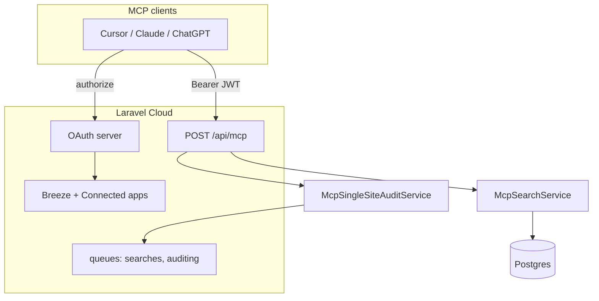

# MCP scan monitoring — Design Spec

**Date:** 2026-06-01  
**Status:** Approved (brainstorming)  
**Scope:** Hosted remote MCP on Laravel Cloud so AI clients can monitor operator searches and start single-site URL audits, authenticated via OAuth with user-revocable access.

**Approach:** Port and adapt ideatub’s proven `oauth-mcp` + `McpController` pattern (Streamable HTTP + legacy JSON-RPC). OAuth-only in v1 — no MCP API keys. Reuse existing `Search`, `DirectUrlScanJob`, policies, and rate limits.

**Reference implementation:** [ideatub](https://github.com/digitales/ideatub) — `docs/mcp-integration-guide.md`, `config/oauth-mcp.php`, `app/Http/Controllers/Api/McpController.php`.

---

## Goal

Operators using Cursor, Claude, or ChatGPT can:

1. **Monitor** their operator searches (`Search` + `Prospect`) from agent chat without opening the web UI.
2. **Start** a single-site URL audit (same outcome as the “Single site audit” card on `/search`).
3. **Revoke** agent access at any time via OAuth (Settings → Connected apps).

Out of scope for v1: niche batch scans, area discovery scans via MCP, outreach/report generation, MCP API keys.

---

## Requirements summary

| Topic | Decision |
|-------|----------|
| Scan scope | Operator `Search` + `Prospect` only |
| Write actions | `start_single_site_audit` only (no area `POST /searches`) |
| Transport | Hosted remote MCP at `POST /api/mcp` (ideatub-style) |
| Auth | OAuth 2.1 + PKCE + DCR; JWT bearer on MCP |
| Revocation | Refresh-token families + Settings → Connected apps |
| Monitoring | Progressive: search summary default; prospect detail on demand |

---

## Architecture



### New components

| Component | Responsibility |
|-----------|----------------|
| `routes/api.php` | `GET/POST/DELETE /api/mcp` |
| `McpController` | JSON-RPC 2.0 + MCP Streamable HTTP; `initialize`, `tools/list`, `tools/call` |
| `oauth-mcp` module | Well-known metadata, DCR, authorize, token, revoke, JWT (RS256) |
| `McpSearchService` | List/get searches; aggregate progress; map prospect DTOs |
| `McpSingleSiteAuditService` | Create `direct_url` search + dispatch `DirectUrlScanJob` |
| `ConnectedAppsController` + view | List/revoke OAuth connector families per user |
| `config/oauth-mcp.php` | Issuer, resource URL, scopes, redirect allowlist, key paths |
| `config/mcp.php` | Streamable Origin allowlist, optional tool-call logging |
| `docs/mcp-integration-guide.md` | Operator setup (Cursor OAuth connector) |

### Reused unchanged

- `Search`, `Prospect`, `SearchPolicy`, `DirectUrlScanJob`, audit pipeline, `SearchStatusService`
- Rate limiter `search-submit:{user_id}` (config `scanner.search_rate_limit_seconds`, default 30s)
- `WebsiteUrlNormalizer`, `StoreDirectUrlSearchRequest` validation rules (mirrored in MCP tool)

### Follow-up (not v1)

- Extract shared `oauth-mcp` Composer package for ideatub + scanner (DRY).
- Optional `scanner:mcp:read` / `scanner:mcp:write` scope split.
- Optional MCP API keys for break-glass automation (ideatub dual-auth pattern).

---

## OAuth & revocation

### Authorization server endpoints

| Endpoint | Purpose |
|----------|---------|
| `GET /.well-known/oauth-protected-resource` | MCP resource metadata |
| `GET /.well-known/oauth-authorization-server` | Discovery (authorize, token, register) |
| `GET /.well-known/jwks.json` | RS256 public keys |
| `POST /oauth/register` | Dynamic client registration |
| `GET /oauth/authorize` | Breeze login + consent |
| `POST /oauth/token` | Authorization code + PKCE → JWT (+ refresh) |
| `POST /oauth/revoke` | Token revocation (RFC 7009-style) |

### Configuration

- `OAUTH_MCP_ISSUER` — typically `APP_URL`
- `OAUTH_MCP_RESOURCE` — `{APP_URL}/api/mcp` (JWT `aud`)
- `scope` — `scanner:mcp` (single scope for v1)
- Access token TTL — 1 hour (env `OAUTH_MCP_ACCESS_TOKEN_TTL`)
- Refresh token TTL — 30 days; absolute lifetime 90 days (match ideatub defaults)
- Keys: `php artisan scanner:oauth-mcp-keys` (or shared command name); deploy via `OAUTH_MCP_*_B64` on Laravel Cloud
- `allowed_redirect_hosts` — `chatgpt.com`, `chat.openai.com`, `platform.openai.com`, `claude.ai`, `claude.com`, `localhost`, `127.0.0.1`, `[::1]`

### MCP request authentication

- **Only** `Authorization: Bearer <JWT>`
- Verify `iss`, `aud` = resource URL, `exp`, `sub` = user id, scope includes `scanner:mcp`
- 401 responses include `WWW-Authenticate` with `resource_metadata` and `scope` (MCP Authorization spec)
- **No** query `?key=` or header API keys in v1

### Consent screen

Copy (example): “Allow **{client_name}** to view your prospect scans and start single-site audits on your behalf.”

### User revocation

| Mechanism | Effect |
|-----------|--------|
| **Settings → Connected apps** → Disconnect | Revokes refresh-token family; no new access tokens |
| Disconnect all | Revokes all active families for user |
| `POST /oauth/revoke` | Client-initiated revoke |

Access tokens remain valid until expiry (~1h) after revoke — acceptable; same as ideatub.

### Eligible users

Existing Breeze-authenticated operators only. OAuth authorize requires web session login.

---

## MCP tools

All tools require valid OAuth bearer token and scope `scanner:mcp`. Reads enforce `SearchPolicy::view`.

### Tool catalogue

| Tool | Type | Description |
|------|------|-------------|
| `list_searches` | Read | Recent operator searches for authenticated user |
| `get_search` | Read | Search status + progress aggregates; optional `include_prospects` |
| `list_search_prospects` | Read | Prospect summaries for one `search_id` |
| `start_single_site_audit` | Write | Submit URL → `direct_url` search + `DirectUrlScanJob` |

### `list_searches`

| Parameter | Type | Default | Notes |
|-----------|------|---------|-------|
| `limit` | integer | 10 | Max 50 |
| `status` | string | — | Optional filter: `pending`, `discovering`, `auditing`, `complete`, `failed` |

Returns array of search summaries (same shape as `SearchController::mapSearchSummary`).

### `get_search`

| Parameter | Type | Required | Notes |
|-----------|------|----------|-------|
| `search_id` | integer | Yes | |
| `include_prospects` | boolean | No | Default `false` |

**Default response** (progressive monitoring — level A):

```json
{
  "search": {
    "id": 42,
    "source": "direct_url",
    "submitted_url": "https://example.com",
    "niche": null,
    "city": null,
    "country": "GB",
    "scan_type": "combined",
    "status": "auditing",
    "total_found": 1,
    "created_at": "2026-06-01T10:00:00.000000Z"
  },
  "progress": {
    "prospects_total": 1,
    "audit_status_counts": {
      "pending": 0,
      "complete": 0,
      "failed": 0,
      "skipped": 0
    },
    "reports_ready": 0,
    "search_complete": false
  },
  "app_url": "https://scanner.example.com/searches/42"
}
```

`progress` is computed from `prospects` relation (no N+1 on large lists when `include_prospects` is false).

**With `include_prospects: true`** — adds `prospects[]` (level B subset).

### Prospect DTO (MCP)

Fields aligned with `SearchController::show` but **excluding** operator-PII and shareable links:

| Include | Exclude |
|---------|---------|
| `id`, `business_name`, `combined_score`, `gbp_score`, `a11y_score`, `performance_score`, `dominant_angle`, `audit_status`, `audit_error`, `gbp_flags`, `a11y_flags`, `report_ready`, `cms_badge`, `cms_pending` | `report_url`, `phone`, `address`, `place_id`, outreach/warm fields |

### `list_search_prospects`

| Parameter | Type | Required |
|-----------|------|----------|
| `search_id` | integer | Yes |

Returns `{ "search_id": 42, "prospects": [ ... ] }` using the same DTO. For agents that fetched search-level status first, then need detail (progressive level C).

### `start_single_site_audit`

| Parameter | Type | Required |
|-----------|------|----------|
| `website_url` | string | Yes |

Behaviour (delegates to same logic as `SearchController::storeDirectUrl`):

1. Rate limit `search-submit:{user_id}` — on failure return JSON-RPC error with wait seconds.
2. Validate URL (same rules as `StoreDirectUrlSearchRequest`).
3. Create `Search`: `source=direct_url`, `scan_type=combined`, `total_found=1`, `status=pending`.
4. Dispatch `DirectUrlScanJob`.
5. Return `{ "search_id": 42, "status": "pending", "app_url": "..." }`.

Does **not** expose area discovery (`niche`, `city`, `scan_type` choice).

### Recommended agent workflow

1. `start_single_site_audit` → `search_id`
2. Poll `get_search` until `search.status` is `complete` or `failed`
3. On failures or score questions → `list_search_prospects` or `get_search` with `include_prospects: true`
4. Use `app_url` for human review in browser

---

## Transport & protocol

Same as ideatub (`docs/mcp-integration-guide.md`):

| Transport | Detection |
|-----------|-----------|
| Legacy JSON-RPC | `Accept: application/json` only |
| MCP Streamable HTTP | `Accept` includes **both** `application/json` and `text/event-stream` |

Streamable flow: `initialize` → `Mcp-Session-Id` → `notifications/initialized` → `tools/list` / `tools/call`.

| Route | Auth | Purpose |
|-------|------|---------|
| `GET /api/mcp` | None | Server info for connector validation |
| `POST /api/mcp` | Bearer | JSON-RPC / Streamable |
| `DELETE /api/mcp` | Bearer | End Streamable session |

`MCP_STREAMABLE_ALLOWED_HOSTS` — comma-separated Origins for browser-based clients.

Direct JSON-RPC method names (legacy) may mirror tool names (`get_search`, etc.) for scripting parity with ideatub.

---

## Security

| Topic | Mitigation |
|-------|------------|
| PKCE | Required (S256) on authorization code flow |
| Authorization codes | Single-use, 10-minute TTL |
| JWT | RS256, short-lived, `aud` bound to `/api/mcp` |
| Redirect URIs | Host allowlist + per-client registered URIs |
| IDOR | `SearchPolicy::view` on all read tools |
| PII | Exclude phone, address, public report URLs from MCP DTOs |
| Rate abuse | Shared search submit limiter for writes |
| CSRF | OAuth authorize uses web session; token endpoint stateless |

---

## UI changes

| Location | Change |
|----------|--------|
| Settings (new page or section) | **Connected apps** — list OAuth families (client label, last used, issued); Disconnect / Disconnect all |
| Profile or Settings nav | Link to Connected apps |
| Help (optional v1) | Short “Connect Cursor via OAuth” with MCP URL `{APP_URL}/api/mcp` |

No change to `/search` or `/searches/{id}` beyond optional “copy MCP search id” (out of scope v1).

---

## Deployment (Laravel Cloud)

1. Set `APP_URL` (HTTPS).
2. Set `OAUTH_MCP_ENABLED=true`, `OAUTH_MCP_ISSUER`, `OAUTH_MCP_RESOURCE`.
3. Generate keys locally; store `OAUTH_MCP_PRIVATE_KEY_B64` / `OAUTH_MCP_PUBLIC_KEY_B64` as secrets.
4. Set `MCP_STREAMABLE_ALLOWED_HOSTS` if Cursor/Claude browser Origins are blocked.
5. Ensure `routes/api.php` loaded (Laravel 11+ default).
6. Document Cursor: **Tools & MCP** → remote URL `https://<host>/api/mcp` → OAuth (not API key).

---

## Testing

| Layer | Cases |
|-------|--------|
| OAuth | Well-known JSON shape; DCR creates client; authorize+token with PKCE; JWT verifies `aud`/`sub`; revoke invalidates refresh family |
| MCP auth | Missing bearer → 401 + `WWW-Authenticate`; wrong `aud` → 401 |
| `list_searches` | Returns only owning user's searches |
| `get_search` | Summary without prospects; with `include_prospects`; 404/403 for other user's search |
| `list_search_prospects` | DTO fields; no `report_url` |
| `start_single_site_audit` | Creates `direct_url` search, dispatches job; rate limit error |
| Streamable | `initialize` + `tools/list` includes four tools (feature test with mocked JWT service, ideatub pattern) |
| Regression | Web `POST /searches/direct` unchanged |

---

## Alternatives considered

| Approach | Verdict |
|----------|---------|
| Port ideatub oauth-mcp + MCP in-repo | **Chosen** for v1 |
| Shared Composer package first | Deferred — DRY follow-up |
| Laravel Passport | Rejected — poor MCP resource/DCR fit; ideatub validated custom module |
| MCP API keys (ideatub dual auth) | Rejected for v1 — user requires OAuth revoke |
| Include phone/address in MCP | Rejected — reduce PII exposure to agents |
| Separate `watch_search` subscription tool | Rejected — polling `get_search` is sufficient for v1 |

---

## Out of scope (v1)

- Niche batch scan monitoring
- Area discovery scan via MCP
- Outreach, report generation, prospect updates via MCP
- MCP API keys
- WebSocket / push notifications for scan completion
- Public/unauthenticated MCP access
