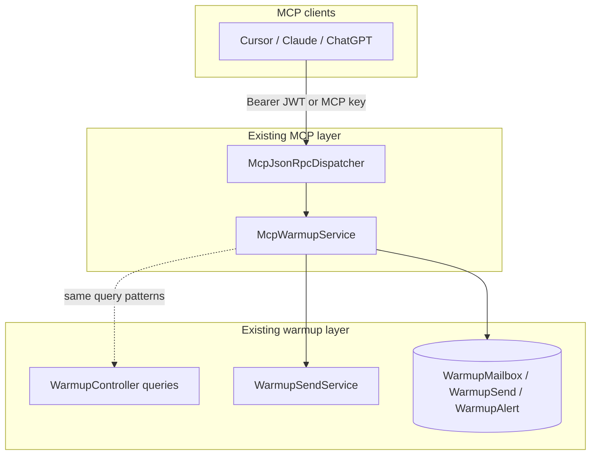

# Warmup MCP tools — Design Spec

**Date:** 2026-06-18  
**Status:** Implemented  
**Scope:** Read-only MCP tools so AI agents can check email warmup mailbox status, plan usage, and deliverability stats without opening the web UI.

**Related:** [Phase 7b monitoring spec](2026-06-18-warmup-phase-7b-design.md) — in-app notification bell complements these tools for browser operators.

**Approach:** Two dedicated tools (`list_warmup_mailboxes`, `get_warmup_mailbox`) on the existing hosted MCP endpoint, backed by a new `McpWarmupService`. Same auth as scan tools (`scanner:mcp` OAuth scope or MCP keys).

---

## Goal

Operators using Cursor, Claude, or ChatGPT can:

1. **Check account setup** — see plan limits, current mailbox counts, and whether warmup setup is complete (outreach + seed mailboxes connected).
2. **Monitor mailbox health** — status, deliverability score, sends today, alert flags.
3. **Drill into a mailbox** — weekly stats, recent send history, alerts, estimated ready date.
4. **Open the UI** — via `app_url` deep links when full detail is needed.

Out of scope: connect/configure mailboxes, pause/resume warmup, dismiss alerts via MCP (use in-app notification bell — see [Phase 7b spec](2026-06-18-warmup-phase-7b-design.md)), paginated send history, streaming progress watches.

---

## Requirements summary

| Topic | Decision |
|-------|----------|
| Tool count | Two: list + get |
| Write actions | None (read-only) |
| Auth | Existing `scanner:mcp` scope or MCP keys — no new scope |
| Plan context | Included in list response (tier, limits, usage, `setup_complete`) |
| Detail payload | Weekly stats, recent sends (50), alerts (20), estimated ready date |
| Sensitive data | Never return credentials, passwords, or IMAP/SMTP config |
| Streaming | Not needed — polled state, not long-running jobs |

---

## Architecture



### New components

| Component | Responsibility |
|-----------|----------------|
| `McpWarmupService` | List/get warmup data scoped to authenticated user; shape MCP payloads |
| `McpJsonRpcDispatcher` | Register two new tools in `methodNames()`, `toolDefinitions()`, `dispatch()` |
| `McpWarmupToolsTest` (or extend `McpScanToolsTest`) | Feature tests for list, get, cross-user denial |
| `docs/mcp-integration-guide.md` | Document new tools and warmup monitoring workflow |

### Reused unchanged

- `WarmupMailbox`, `WarmupSend`, `WarmupAlert` models
- `WarmupSendService::getEstimatedReadyDate()`
- `User::warmupTier()`, `User::warmupTierLimits()`
- `config/warmup_tiers.php`
- OAuth/MCP key auth on `POST /api/mcp`
- Query patterns from `WarmupController@index` and `WarmupController@show`

### Optional extraction

If list/get mapping duplicates controller logic noticeably, extract a `WarmupSummaryMapper` (mirroring `SearchSummaryMapper`). Do not extract preemptively — inline queries in `McpWarmupService` are acceptable for two endpoints.

---

## Tools

### `list_warmup_mailboxes`

List the authenticated user's warmup mailboxes with plan context.

**Input schema:**

| Parameter | Type | Required | Description |
|-----------|------|----------|-------------|
| `status` | string | No | Filter by mailbox status: `pending`, `warming`, `ready`, `at_risk`, `paused`, `failed` |

**Response:**

```json
{
  "plan": {
    "tier": "solo",
    "limits": {
      "max_outreach_mailboxes": 1,
      "max_seed_mailboxes": 3,
      "pool_participation_allowed": false
    },
    "usage": {
      "outreach_mailboxes": 1,
      "seed_mailboxes": 2
    },
    "setup_complete": true
  },
  "mailboxes": [
    {
      "id": 12,
      "email": "ross@nthdesign.co.uk",
      "provider": "fastmail",
      "is_outreach_mailbox": true,
      "is_seed_mailbox": false,
      "status": "warming",
      "deliverability_score": 72,
      "days_warming": 5,
      "sends_today": 8,
      "warmup_enabled": true,
      "has_unread_alerts": true
    }
  ],
  "app_url": "https://scanner.example.com/warmup"
}
```

**`setup_complete` logic:** `true` when the user has at least one outreach mailbox and at least one seed mailbox.

**`sends_today`:** Count of `WarmupSend` rows where `from_mailbox_id` matches and `sent_at` is today (same as `WarmupController@index`).

**`has_unread_alerts`:** True when the mailbox has alerts with `read_at` null.

---

### `get_warmup_mailbox`

Drill-down for a single mailbox.

**Input schema:**

| Parameter | Type | Required | Description |
|-----------|------|----------|-------------|
| `mailbox_id` | integer | Yes | Warmup mailbox ID |

**Response:**

```json
{
  "mailbox": {
    "id": 12,
    "email": "ross@nthdesign.co.uk",
    "provider": "fastmail",
    "status": "warming",
    "deliverability_score": 72,
    "days_warming": 5,
    "warmup_enabled": true,
    "warmup_ramp_days": 14,
    "last_imap_check_at": "2026-06-18T10:30:00Z",
    "estimated_ready_date": "2026-06-27"
  },
  "stats": {
    "sends_this_week": 42,
    "replies_received": 38,
    "spam_rescues": 2
  },
  "recent_sends": [
    {
      "id": 901,
      "subject": "Quick follow-up",
      "sent_at": "2026-06-18T09:15:00Z",
      "status": "opened",
      "opened_at": "2026-06-18T09:22:00Z",
      "replied_at": null,
      "rescued_from_spam_at": null
    }
  ],
  "alerts": [
    {
      "id": 3,
      "type": "at_risk",
      "message": "Deliverability score has dropped below 50. Review your DNS and sending patterns.",
      "created_at": "2026-06-17T14:00:00Z",
      "read_at": null
    }
  ],
  "app_url": "https://scanner.example.com/warmup/12"
}
```

**Stats window:** Current calendar week (since `now()->startOfWeek()`), matching `WarmupController@show`.

**Recent sends:** Last 50 sends ordered by `sent_at` desc; fields: `id`, `subject`, `sent_at`, `status`, `opened_at`, `replied_at`, `rescued_from_spam_at`.

**Alerts:** Last 20 alerts ordered by `created_at` desc; includes both read and unread.

**`estimated_ready_date`:** From `WarmupSendService::getEstimatedReadyDate()`; `null` when already ready or warmup not started.

---

## Auth & authorization

- Same transport and auth as existing MCP tools (`POST /api/mcp`, OAuth bearer or `x-scanner-key`).
- Scope: `scanner:mcp` (no new scope).
- All queries scoped to `$user->warmupMailboxes()`.
- `get_warmup_mailbox`: verify mailbox belongs to user; throw `InvalidArgumentException('Mailbox not found')` if not (do not leak cross-user existence).

---

## Error handling

| Situation | Behaviour |
|-----------|-----------|
| Missing `mailbox_id` on get | `InvalidArgumentException` → tools/call error text |
| Mailbox not found or not owned | "Mailbox not found" |
| Invalid `status` filter on list | Ignored (same as `list_searches`) |
| User has no mailboxes | Empty `mailboxes` array, `setup_complete: false` |
| Internal failure | Generic "Internal error" via existing MCP error path |

No streaming or `watch_*` tool — agents poll `get_warmup_mailbox` as needed.

---

## Monitoring workflow

1. `list_warmup_mailboxes` → check `setup_complete`, scan for `has_unread_alerts` or `status: at_risk`
2. `get_warmup_mailbox` with `mailbox_id` → inspect stats, recent sends, alert messages
3. Open `app_url` in browser for full UI (connect, pause, configure)

---

## Testing

Feature tests (new `McpWarmupToolsTest` or extend `McpScanToolsTest`):

1. `tools/list` includes `list_warmup_mailboxes` and `get_warmup_mailbox`
2. `list_warmup_mailboxes` returns plan summary and mailbox summaries for authenticated user
3. `list_warmup_mailboxes` with `status` filter returns only matching mailboxes
4. `get_warmup_mailbox` returns stats, recent sends, and alerts for owned mailbox
5. `get_warmup_mailbox` for another user's mailbox returns error
6. User with no mailboxes gets valid empty list and `setup_complete: false`

Use existing OAuth mock pattern from `McpScanToolsTest`.

---

## Documentation

Update `docs/mcp-integration-guide.md`:

- Add both tools to the tools table
- Add a "Warmup monitoring workflow" section (list → get → app_url)

---

## Future extensions (not in this spec)

- Write tools: pause/resume warmup, dismiss alerts
- `list_warmup_sends` with pagination for deep investigation
- Aggregate account stats (total sends this week, average deliverability)
- Separate OAuth scope if warmup access needs finer-grained revocation
