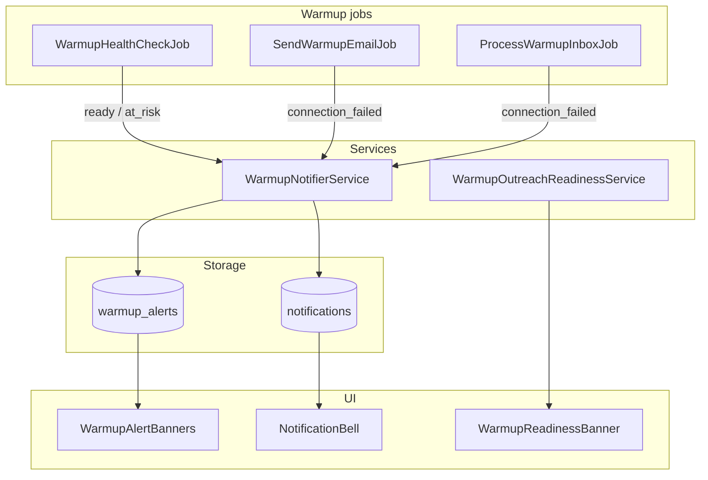

# Warmup monitoring & outreach integration — Design Spec

**Date:** 2026-06-18  
**Status:** Implemented  
**Scope:** Phase 7b — in-app notifications, outreach readiness banners, at-risk DNS guidance, and shared UI components for warmup monitoring.

**Approach:** `WarmupNotifierService` centralises `WarmupAlert` + Laravel database notifications. `WarmupOutreachReadinessService` drives a soft gate on `/outreach`. Reusable `SkipBanner` and extracted warmup banner components align with the operator UI kit.

**Related:** [Warmup feature notes](../../concept/warmup-feature-detailed-notes.md) · [Warmup MCP tools](2026-06-18-warmup-mcp-tools-design.md) · [Shared seed pool](2026-06-18-warmup-shared-pool-design.md)

---

## Goal

Operators warming a new outreach domain need to know when it is safe to send cold email — without checking `/warmup` daily. The outreach workspace should reflect mailbox readiness, and critical warmup events (ready, at risk, connection failure) should surface in-app immediately.

**Exit criterion:** Operator is notified when a mailbox hits Ready; `/outreach` reflects readiness state; at-risk mailboxes show actionable DNS guidance.

---

## Decisions

| Topic | Decision |
|-------|----------|
| Notification channel | Laravel `database` notifications on `users` — no email/SMS in v1 |
| Alert types | `ready`, `at_risk`, `connection_failed` (same enum as `warmup_alerts`) |
| Duplicate suppression | One unread alert per type per mailbox (`WarmupNotifierService`) |
| Outreach gate | Soft warning banner only — generation not blocked |
| Ready states | `no_mailbox`, `not_ready`, `ready` from outreach mailboxes |
| Estimated ready date | From `WarmupSendService::getEstimatedReadyDate()`; formatted in UI |
| At-risk banner | Score &lt; 60 after day 3, or `status = at_risk`; link to MXToolbox |
| Alert read on view | Opening `/warmup/{id}` marks that mailbox's alerts read |
| Score trend chart | **Deferred** — requires daily score snapshots + chart library |
| Agency+ domain selector | **Deferred** — single primary ready mailbox shown on `/outreach` |

---

## Architecture



### New components

| Component | Responsibility |
|-----------|----------------|
| `WarmupNotifierService` | Create `WarmupAlert` + `WarmupMailboxNotification` when unread alert of same type does not exist |
| `WarmupOutreachReadinessService` | Resolve `no_mailbox` / `not_ready` / `ready` for authenticated user |
| `WarmupMailboxNotification` | Database notification payload: `alert_type`, `mailbox_email`, `message`, `url` |
| `NotificationController` | `POST /notifications/{id}/read`, `POST /notifications/read-all` |
| `SkipBanner` | Reusable status banner (`default`, `success`, `critical`) |
| `WarmupReadinessBanner` | Outreach workspace readiness states |
| `WarmupAlertBanners` | Mailbox detail at-risk + unread alert display |
| `NotificationBell` | App shell dropdown; unread count badge |
| `useDismissiblePopover` | Shared escape/outside-click dismiss for dropdowns |

### Extended components

| Component | Change |
|-----------|--------|
| `WarmupHealthCheckJob` | Notify on transition to `ready` or `at_risk` via `WarmupNotifierService` |
| `SendWarmupEmailJob` / `ProcessWarmupInboxJob` | `failed()` uses notifier for `connection_failed` |
| `OutreachController` | Passes `warmup_readiness` prop |
| `WarmupController::show()` | Marks alerts read; passes unread `alerts` array |
| `HandleInertiaRequests` | Shares `notifications` (10 recent unread) + `unreadNotificationsCount` |

---

## Database

### `notifications` (Laravel standard)

Created via `php artisan notifications:table`. Stores `WarmupMailboxNotification` payloads per user.

### `warmup_alerts` (existing)

| Column | Notes |
|--------|-------|
| `type` | `ready`, `at_risk`, `connection_failed`, `pool_excluded` |
| `read_at` | Set when mailbox detail viewed or notification dismissed |

---

## API / routes

| Method | Route | Purpose |
|--------|-------|---------|
| `POST` | `/notifications/{notification}/read` | Mark one notification read |
| `POST` | `/notifications/read-all` | Mark all user notifications read |

---

## UI behaviour

### App shell — `NotificationBell`

- Bell icon in top bar next to user menu
- Badge shows unread count
- Dropdown lists up to 10 unread notifications (from shared Inertia props)
- Click item → mark read + navigate to `url` (mailbox detail)
- "Mark all as read" when count &gt; 0

### `/outreach` — `WarmupReadinessBanner`

| State | Banner |
|-------|--------|
| `ready` | Green: "Sending from {email}. Mailbox is ready for cold outreach." |
| `not_ready` | Amber: domain not ready + formatted estimated date + link to `/warmup` |
| `no_mailbox` | Amber: no outreach mailbox + link to `/warmup/connect` |

### `/warmup/{id}` — `WarmupAlertBanners`

- Critical banner when `at_risk` or score &lt; 60 after day 3 — SPF/DKIM/DMARC copy + MXToolbox link
- Default banner for other unread alerts (e.g. `connection_failed`, `ready`)

---

## Notification triggers

| Event | Job | Alert type | Message (summary) |
|-------|-----|------------|-------------------|
| Score ≥ 80 and ramp complete | `WarmupHealthCheckJob` | `ready` | Mailbox ready for cold outreach |
| Score drops, status → `at_risk` | `WarmupHealthCheckJob` | `at_risk` | Review DNS and sending patterns |
| 3 consecutive send/inbox failures | `SendWarmupEmailJob` / `ProcessWarmupInboxJob` | `connection_failed` | Check credentials and reconnect |

---

## Tests

| Test | Coverage |
|------|----------|
| `WarmupOutreachReadinessServiceTest` | `no_mailbox`, `not_ready`, `ready` states |
| `WarmupNotifierServiceTest` | Single alert + notification per type |
| `WarmupHealthCheckJobTest` | Ready notification on promotion |
| `OutreachIndexTest` | `warmup_readiness` Inertia props |
| `NotificationControllerTest` | Mark read / mark all read |

```bash
php artisan migrate
php artisan test --filter='WarmupOutreachReadiness|WarmupNotifier|WarmupHealthCheck|OutreachIndex|NotificationController'
npm run build
```

---

## Deferred (future)

| Item | Reason |
|------|--------|
| Score trend chart (recharts) | No daily score history table yet |
| Email notifications (Agency+ tier) | In-app only for v1; tier matrix reserves email channel |
| Agency+ sending-domain selector on `/outreach` | Single primary mailbox sufficient for internal use |
| Dismiss alerts without opening mailbox | Notifications mark read via bell; alerts mark read on mailbox view |

---

## Tier note

The tier matrix lists "Email notifications" for Agency+. Phase 7b ships **in-app** notifications for all tiers. Email delivery of warmup alerts is a separate follow-up.
