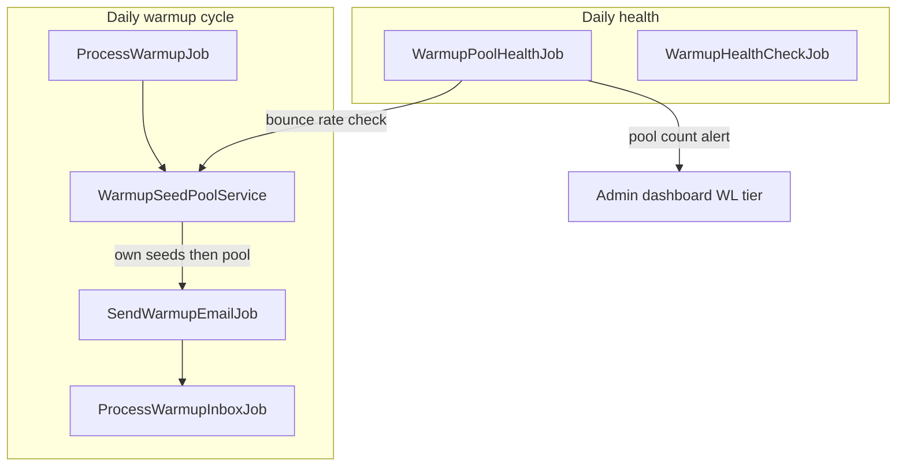

# Warmup shared seed pool — Design Spec

**Date:** 2026-06-18  
**Status:** Implemented  
**Scope:** Phase 7c — cross-user shared seed network for Agency+ tiers, with pool health monitoring, bounce exclusion, and white-label admin view.

**Plan:** See `docs/concept/warmup-feature-detailed-notes.md` (Phase 7c section).

**Approach:** New `WarmupSeedPoolService` owns pool eligibility and selection. Own seeds fill daily volume first; global pool fills gaps. Solo tier unchanged (self-seeded only).

---

## Goal

Agency and white-label customers can warm outreach domains using a shared network of opt-in seed mailboxes, without exposing seed credentials or addresses across accounts. The network grows via default-on pool participation with explicit consent at connect time.

**Exit criterion:** Two test accounts cross-seed correctly; pool size displayed accurately on the dashboard.

---

## Requirements summary

| Topic | Decision |
|-------|----------|
| Seed selection | Own seeds first; shared pool fills remaining daily volume |
| Start gate | 2 own seeds **or** active pool ≥ N (Agency+ only) |
| Reciprocity | None — pool access is a tier perk |
| N threshold | Config-driven; launch at **10**, raise later (e.g. 50) |
| Pool opt-in | Default **ON** + mandatory consent copy on connect (Agency+) |
| Active pool seed | `is_seed_mailbox` + `is_pool_participant` + `status != failed` |
| Auto-exclusion | Bounce-rate → `is_pool_participant = false` + owner alert |
| Admin view | White label tier only at `/admin/warmup-pool` |
| Solo tier | Self-seeded only; never uses or contributes to pool |

---

## Architecture



### New components

| Component | Responsibility |
|-----------|----------------|
| `WarmupSeedPoolService` | Eligibility queries, own+pool merge, pool counts, start-gate logic |
| `WarmupPoolHealthJob` | Daily bounce-rate audit; auto-exclude; low-pool logging |
| `config/warmup_pool.php` | Thresholds: min pool size, alert size, bounce limits |
| `WarmupPoolController` | White-label admin view at `/admin/warmup-pool` |
| `Warmup/Admin/Pool.jsx` | Admin pool health dashboard |

### Modified components

| Component | Change |
|-----------|--------|
| `WarmupMailboxService::getSeedPool()` | Delegates to `WarmupSeedPoolService` |
| `WarmupController` | Pool stats on index; toggle `is_pool_participant`; updated start gate |
| `Warmup/Connect.jsx` | Consent copy + pool toggle (Agency+ only) |
| `WarmupMailboxCard.jsx` | Pool toggle on seed cards; pool contribution status |
| `SendWarmupEmailJob` | Record `status = bounced` on recipient-rejected SMTP failures |
| `McpWarmupService` | Include `pool_size`, `can_use_pool`, updated `setup_complete` logic |
| `Warmup/Index.jsx` | Updated `needsSeeds` logic; network pool size display |

### Reused unchanged

- `ProcessWarmupJob`, `ProcessWarmupInboxJob`, `ReplyToWarmupEmailJob`, `WarmupHealthCheckJob`
- `WarmupSendService::sendWarmupEmail()`, `processInbox()`, `replyToWarmupEmail()`
- `config/warmup_tiers.php` — `pool_participation_allowed` per tier
- `is_pool_participant` column on `warmup_mailboxes`
- 24-hour recent-pair exclusion on `warmup_sends`

### Prerequisite (bundle as first 7c task)

**P6 — IMAP `since()` filter** (from phase-7a bugfix prompts): `WarmupSendService::processFolder()` must filter by `last_imap_check_at` before 7c goes live. Cross-user traffic increases per-seed inbox volume; unbounded scans will not scale.

---

## Pool selection

`WarmupSeedPoolService::seedsForOutbox(WarmupMailbox $outbox, int $count): Collection`

### Step 1 — Own seeds

Query mailboxes where:

- `user_id = $outbox->user_id`
- `is_seed_mailbox = true`
- `id != $outbox->id`
- Not in 24h recent-pair exclusion for this outbox

Shuffle and take up to `$count`.

### Step 2 — Shared pool (if short and tier allows)

Only when `$user->warmupTierLimits()['pool_participation_allowed']` is true and own seeds < `$count`.

Query mailboxes where:

- `is_seed_mailbox = true`
- `is_pool_participant = true`
- `status != 'failed'`
- `user_id != $outbox->user_id`
- Email domain ≠ outreach mailbox domain (extract domain from `email` column)
- Not in 24h recent-pair exclusion for this outbox

Shuffle; take remaining `$count - own_count`.

### Step 3 — Merge

Return own seeds first, then pool seeds. `ProcessWarmupJob::buildSeedCycle()` unchanged — cycles over the merged collection.

### Domain extraction

Use a small helper: `Str::after($email, '@')` lowercased. Exclude pool seeds on the same domain as the outreach mailbox to avoid same-domain warming pairs.

---

## Start gate

`WarmupSeedPoolService::canStartWarmup(User $user): bool`

Returns true when the user has at least one outreach mailbox **and** either:

- `own_seed_count >= 2`, **or**
- `pool_participation_allowed && active_pool_count >= config('warmup_pool.min_size')`

**Solo:** always requires `own_seed_count >= 2`; never checks pool.

Update `Warmup/Index.jsx`:

- Replace `needsSeeds = seedCount < 2` with server-provided `can_start_warmup` / `needs_seeds` flags
- When Agency+ can start via pool only, show: *"Using network seeds — add your own seeds to improve warmup diversity."* instead of the blocking banner

---

## Privacy

Cross-user pool seed addresses are **never** exposed to other users.

| Surface | Pool recipient display |
|---------|------------------------|
| `/warmup/{id}` send history | `"Network seed"` (not real email) |
| `/warmup` dashboard | Count only: *"Network: ~142 seed mailboxes"* |
| MCP `get_warmup_mailbox` | `to_email: "Network seed"` when `to_mailbox` belongs to another user |
| Admin `/admin/warmup-pool` | Real emails visible (white label operator only) |

Implementation: add `WarmupSend::isPoolRecipient(): bool` (or check `toMailbox->user_id !== fromMailbox->user_id`) and mask in controller/MCP mappers.

Credentials (`password_encrypted`, IMAP/SMTP hosts) never appear in API responses — unchanged from existing behaviour.

---

## Connect flow (Agency+)

On `/warmup/connect`, when `is_seed_mailbox` is checked and tier allows pool:

1. Show checkbox: **"Join shared seed network"** — default **checked**
2. Show consent copy: *"Your seed mailbox may receive warmup emails from other users' domains. Email addresses are never shared between accounts."*
3. Require explicit consent acknowledgment when checkbox is checked (second checkbox or combined control)
4. Persist `is_pool_participant` from checkbox value

**Solo:** hide toggle; force `is_pool_participant = false` in controller (existing).

### Existing seed toggle

On seed mailbox cards (Agency+), add toggle to opt in/out of pool after connect. PATCH endpoint: `WarmupController::togglePoolParticipation(WarmupMailbox $mailbox)`.

When opting out: set `is_pool_participant = false`. When opting in: show consent modal; set true on confirm.

---

## Bounce detection and exclusion

### Detection

`SendWarmupEmailJob`: on SMTP transport failure indicating recipient rejection (permanent 5xx / recipient rejected), update the `WarmupSend` row:

```php
'status' => 'bounced',
```

Use `WarmupTransportException` or Symfony Mailer exception inspection to distinguish recipient rejection from connection/auth failures (which increment `consecutive_failures` on the sending mailbox, not bounce on the send row).

### Exclusion (`WarmupPoolHealthJob` — daily, after sends)

For each mailbox where `is_seed_mailbox && is_pool_participant && status != failed`, over trailing `config('warmup_pool.lookback_days')` days:

Count `WarmupSend` rows where `to_mailbox_id = seed.id` and `status = bounced`.

Exclude from pool when:

- `bounce_count >= config('warmup_pool.bounce_count_threshold')` (default **5**), **or**
- `bounce_count / total_received >= config('warmup_pool.bounce_rate_threshold')` (default **0.30**) **and** `total_received >= config('warmup_pool.bounce_rate_min_sends')` (default **10**)

Action:

1. Set `is_pool_participant = false`
2. Create `WarmupAlert` for seed owner: *"Removed from shared network due to high bounce rate. Check your mailbox is active and receiving mail."*

Connection failures already set `status = failed` on the mailbox, removing it from the active pool definition — no additional work.

### Low-pool alert

When `active_pool_count < config('warmup_pool.alert_size')` (default **50**), log warning and surface on white-label admin dashboard. No user-facing block — `min_size` (10) is the only user gate.

---

## Configuration

New file `config/warmup_pool.php`:

```php
return [
    'min_size' => (int) env('WARMUP_POOL_MIN_SIZE', 10),
    'alert_size' => (int) env('WARMUP_POOL_ALERT_SIZE', 50),
    'bounce_count_threshold' => 5,
    'bounce_rate_threshold' => 0.30,
    'bounce_rate_min_sends' => 10,
    'lookback_days' => 7,
];
```

Tune `min_size` via env as the network grows without code changes.

---

## Admin view (white label only)

**Route:** `GET /admin/warmup-pool`  
**Gate:** `auth` + `User::warmupTier() === 'white_label'`

**Display:**

- Active pool count vs `min_size` / `alert_size`
- Pool sends last 24h / 7d
- Seeds excluded in last 7 days (bounce exclusion) with email and bounce stats
- Top bounce-rate seeds (admin-only email visibility)

No new admin role infrastructure — reuse subscription tier as gate per tier matrix.

---

## Dashboard updates

### `/warmup` index props (add)

```php
'pool' => [
    'active_count' => $poolService->countActivePoolSeeds(),
    'min_size' => config('warmup_pool.min_size'),
    'can_use_pool' => $limits['pool_participation_allowed'],
    'pool_ready' => $poolService->countActivePoolSeeds() >= config('warmup_pool.min_size'),
],
'can_start_warmup' => $poolService->canStartWarmup($user),
'needs_seeds' => ! $poolService->canStartWarmup($user),
```

### Stats strip

Add or extend stat tile: **Network seeds** (Agency+ only, count when pool_ready).

---

## MCP updates

Extend `McpWarmupService::listMailboxes()` plan context:

```json
{
  "pool": {
    "active_count": 142,
    "min_size": 10,
    "pool_ready": true,
    "can_use_pool": true
  },
  "setup_complete": true
}
```

Update `setup_complete` logic: outreach connected + (`own_seeds >= 2` OR `pool_ready` for Agency+).

Mask pool recipient emails in send history on `get_warmup_mailbox`.

---

## Scheduling

| Job | Schedule | Purpose |
|-----|----------|---------|
| `WarmupPoolHealthJob` | Daily 09:30 | Bounce exclusion; log low-pool warning |
| `ProcessWarmupJob` | Daily 08:00 | Unchanged; uses new pool selection |
| `WarmupHealthCheckJob` | Daily 09:00 | Unchanged |

Register in `routes/console.php` (or existing scheduler).

---

## Testing

### Unit — `WarmupSeedPoolServiceTest`

1. Own seeds returned before pool seeds when both available
2. Pool seeds excluded when same `user_id`
3. Pool seeds excluded when same email domain as outreach
4. Pool seeds excluded when used in last 24h
5. Solo user never receives pool seeds
6. `canStartWarmup` true for Agency+ with 0 own seeds when pool ≥ min_size
7. `canStartWarmup` false for Agency+ with 0 own seeds when pool < min_size
8. `countActivePoolSeeds` counts only `is_seed_mailbox && is_pool_participant && status != failed`

### Feature — `WarmupSharedPoolTest`

1. User A outreach sends to User B pool seed when A's own seeds exhausted (assert `WarmupSend.to_mailbox_id` belongs to B)
2. User A send history masks B's email as `"Network seed"`
3. Bounce exclusion removes seed from pool and creates alert
4. White-label user can access `/admin/warmup-pool`; Agency user gets 403
5. Connect form requires consent when pool checkbox checked

### Feature — cross-user denial

User A cannot see User B seed email in any API/Inertia response.

---

## Out of scope

- Reciprocity gates (must contribute to consume)
- Custom seed domains (white label tier, later)
- MCP write actions (toggle pool participation via agent)
- Real-time pool WebSocket updates
- Per-user pool send quotas / rate limits beyond existing daily volume ramp
- GDPR data processing agreement copy (consent line only in v1)

---

## Build order

1. **P6** — IMAP `since()` filter (prerequisite)
2. **`config/warmup_pool.php`** + `WarmupSeedPoolService` + unit tests
3. **Wire `getSeedPool()`** + bounce detection in `SendWarmupEmailJob`
4. **Start gate** + dashboard/MCP pool stats + privacy masking
5. **Connect consent UI** + seed card pool toggle
6. **`WarmupPoolHealthJob`** + bounce exclusion
7. **Admin view** (white label)
8. **Cross-user feature tests** (exit criterion)

---

## Tier matrix (unchanged)

| Feature | Solo | Agency | White label |
|---------|------|--------|-------------|
| Shared seed network | No | Yes | Yes |
| Admin pool health view | No | No | Yes |
| Max seed mailboxes | 3 | 10 | 20 |
