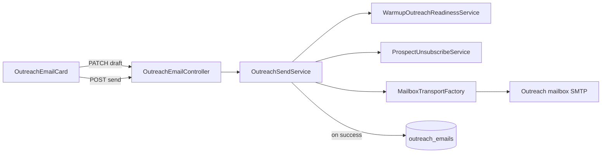

# In-app outreach send — Design Spec

**Date:** 2026-07-01  
**Status:** Approved  
**Scope:** User-initiated cold email send from the scanner via the warmed outreach mailbox; accurate `sent_at` tracking; generated vs sent copy history. Contact form and LinkedIn channels remain copy-paste.

**Approach:** Sync send via shared SMTP transport extracted from warmup; immutable `generated_*` snapshots plus `sent_*` on successful delivery; tiered readiness gate on Send (hard block / warn / allow).

**Related:** [Warmup phase 7b](2026-06-18-warmup-phase-7b-design.md) · [Prospect email & unsubscribe](2026-06-12-prospect-email-unsubscribe-design.md) · [Contact form outreach](2026-06-17-contact-form-outreach-design.md) · [Outreach report refresh](2026-07-01-outreach-report-refresh-design.md)

---

## Goal

Operators today generate outreach drafts in the scanner, copy them into Gmail, send manually, then click **Mark sent**. This causes two problems:

1. **Tracking accuracy** — `sent_at` and warm-lead status depend on manual follow-up and may not reflect reality.
2. **Deliverability** — sends often go from personal Gmail instead of the warmed outreach domain (SPF/DKIM on `nthdesign.co.uk` or equivalent).

Operators need to **send email one prospect at a time from `/outreach` (or prospect detail)**, through the connected outreach mailbox, with optional inline edits before send, and a durable record of both the AI-generated copy and the final sent version.

Contact form and LinkedIn outreach stay copy-paste with **Mark sent** — no automated submission in v1.

---

## Decisions

| Topic | Decision |
|-------|----------|
| Primary motivation | Accurate send tracking + deliverability via warmed mailbox |
| Send trigger | One card at a time — review, optionally edit, click **Send** |
| Channels | **Email:** in-app SMTP send. **Contact form / LinkedIn:** copy-paste + Mark sent (unchanged) |
| Send mechanism | Synchronous HTTP → SMTP (reuse warmup mailbox credentials) |
| Readiness gate | **Tiered on Send only** — generation remains soft-gated (banner) |
| Pre-send edit | Inline edit on card; save on blur |
| Edit guardrails | Send blocked if unsubscribe footer missing from body |
| History | Immutable `generated_*` at creation; `sent_*` populated on successful send |
| Daily volume | Soft cap only — warn when over threshold (default 20/day), never block |
| Batch send | Out of scope v1 |
| Reply / open tracking | Out of scope v1 |

---

## Readiness tiers (Send gate)

Evaluated per user + primary outreach mailbox at send time.

| Tier | Conditions | UI |
|------|------------|-----|
| **Blocked** | No outreach mailbox; deliverability score &lt; 60; status `failed` or `paused`; prospect has no email; email suppressed | Send disabled |
| **Warn** | Score 60–79; status `warming` or `at_risk`; score ≥ 60 but status not yet `ready`; cold sends today ≥ soft cap (config, default 20) | Send enabled; requires `confirm_warned: true` on POST |
| **Allowed** | Status `ready` and score ≥ 80; under soft daily cap | Send enabled without extra confirmation |

Score and status come from existing `WarmupMailbox` fields (`deliverability_score`, `status`, `WarmupMailbox::statusForScore`).

---

## Architecture

### New components

| Component | Responsibility |
|-----------|----------------|
| `MailboxTransportFactory` | Build Symfony SMTP `TransportInterface` from `WarmupMailbox` (extracted from `WarmupSendService`) |
| `OutreachSendService` | Resolve send tier, validate guardrails, count daily sends, send email, persist `sent_*` + metadata |
| `OutreachSendReadiness` | Value object: `blocked` / `warn` / `allowed` + reason string |
| `config/outreach.php` | `soft_daily_cap` (default 20), SMTP timeout (default 15s) |
| `POST /outreach-emails/{id}/send` | User-initiated send |
| `PATCH /outreach-emails/{id}` | Save draft edits (`subject_line`, `email_body`) |

### Extended components

| Component | Change |
|-----------|--------|
| `GenerateOutreachEmailJob` | After generation, set `generated_subject` / `generated_body`; initialise working copy |
| `OutreachEmail` model | New fillable columns; `fromMailbox()` relation |
| `OutreachEmailResource` | Expose `generated_*`, `sent_*`, `send_source`, `was_edited`, send tier hints for UI |
| `OutreachEmailCard` | Editable draft, **Send** button, tier banners, history expander |
| `WarmupReadinessBanner` | Mention in-app send when ready; clarify Send blocked/warned when not |
| `WarmupSendService` | Delegate transport creation to `MailboxTransportFactory` |
| `ExportController` | Optional: `send_source`, `from_mailbox` columns |

### Unchanged

- `OutreachChannelCard` — form/LinkedIn copy-paste + Mark sent
- `GenerateOutreachEmailJob` unsubscribe skip at generation
- `ProspectUnsubscribeService::appendUnsubscribeFooter` — footer appended at generation; operator must preserve on edit
- Warmup seed exchange jobs and volume ramp

---

## Data model

### New columns on `outreach_emails`

| Column | Type | Purpose |
|--------|------|---------|
| `generated_subject` | string, nullable | Immutable AI subject at generation |
| `generated_body` | text, nullable | Immutable AI body at generation (includes unsubscribe footer) |
| `sent_subject` | string, nullable | Subject actually sent; null until send |
| `sent_body` | text, nullable | Body actually sent; null until send |
| `from_mailbox_id` | FK → `warmup_mailboxes`, nullable | Outreach mailbox used for SMTP |
| `smtp_message_id` | string, nullable | Message-ID header |
| `send_source` | enum: `app`, `manual` | How `sent_at` was set |

### Column semantics

| Column | Role |
|--------|------|
| `subject_line` / `email_body` | Editable working draft until `sent_at` is set |
| `generated_*` | Written once at generation; never updated |
| `sent_*` | Written on successful in-app send; for manual Mark sent (legacy/form/LinkedIn), copy from working body |

### Backfill migration

For existing rows where `generated_body` is null:

- Set `generated_subject = subject_line`, `generated_body = email_body`
- Rows with `sent_at` already set: set `sent_subject` / `sent_body` from current columns; `send_source = manual`; `from_mailbox_id` null

### History display

- **Edited indicator** when `sent_body` is not null and differs from `generated_body` (or draft differs before send)
- Collapsible **"Original generated copy"** on sent cards when versions differ

---

## Send flow

### `POST /outreach-emails/{id}/send`

Request body (optional): `{ "confirm_warned": true }`

1. Authorise — user owns row; `channel = email`; `sent_at` is null
2. Load prospect; re-check `ProspectUnsubscribeService::outreachSkipReason` → 422 if suppressed / no email
3. `OutreachSendService::resolveTier(user)` → blocked / warn / allowed
4. If **blocked** → 422 with reason; no SMTP attempt
5. If **warn** and `confirm_warned` is not true → 422 with `requires_confirmation: true`
6. Validate working copy:
   - Body contains this prospect's signed unsubscribe URL (`/unsubscribe?` with matching prospect + email params)
   - `subject_line` and `email_body` non-empty
7. Select mailbox — first `ready` outreach mailbox for user (same as `WarmupOutreachReadinessService` primary)
8. Build plain-text `Email` via Symfony Mailer; From = mailbox address; To = `prospect.email`
9. SMTP send synchronously (timeout from config)
10. On success:
    - `sent_subject` / `sent_body` ← working copy
    - `sent_at` ← now()
    - `from_mailbox_id`, `smtp_message_id`
    - `send_source` ← `app`
11. On failure — flash error; `sent_at` remains null; draft preserved

### `PATCH /outreach-emails/{id}`

- Allowed when `sent_at` is null and `channel = email`
- Updates `subject_line`, `email_body` only
- Unsubscribe footer not required on save — only on send

### Soft daily cap

Count rows where `send_source = app`, `from_mailbox_id` matches mailbox, `sent_at` is today (user timezone or app timezone — use `today()` consistent with warmup `sends_today`).

Over `config('outreach.soft_daily_cap')` → **warn** tier.

---

## Error handling

| Failure | Behaviour |
|---------|-----------|
| SMTP auth / connection | Flash: could not connect; link to `/warmup` credentials |
| Recipient rejected | Flash with provider message; row unsent |
| Request timeout | Flash: retry; row unsent |
| Blocked tier | 422 JSON/HTML error; no SMTP attempt |
| Missing unsubscribe footer | 422: "Unsubscribe link required before send" |

---

## UI

### `OutreachEmailCard` — unsent

- Editable subject + body (save on blur via PATCH)
- Primary: **Send** (replaces Mark sent for email)
- Tier banner on card when blocked or warn
- Warn tier: first Send click shows confirm; second POST includes `confirm_warned`

### `OutreachEmailCard` — sent

- Read-only `sent_subject` / `sent_body`
- Footer: "Sent {date} from {mailbox@domain}"
- **Edited** pill + expand **Original generated copy** when `sent_body !== generated_body`
- **Got response** unchanged

### `/outreach`

- `WarmupReadinessBanner` copy updated for in-app send context
- No batch send in v1

### Form / LinkedIn (`OutreachChannelCard`)

- Unchanged — Copy, Mark sent, Got response

---

## API routes

| Method | Path | Action |
|--------|------|--------|
| PATCH | `/outreach-emails/{outreachEmail}` | Save draft |
| POST | `/outreach-emails/{outreachEmail}/send` | Send email |
| PATCH | `/outreach-emails/{outreachEmail}/sent` | Mark sent — **retained for non-email channels only**; remove from email card UI |

---

## Testing

| Test | Asserts |
|------|---------|
| `OutreachSendServiceTest` | Tier resolution; guardrail rejects body without unsubscribe URL |
| `OutreachSendTest` (feature) | Mocked SMTP → `sent_at`, `sent_*`, `from_mailbox_id`, `send_source = app` |
| Feature: blocked tier | 422; no `sent_at` |
| Feature: warn tier | Requires `confirm_warned` |
| Feature: suppression at send | 422 |
| Feature: draft PATCH | Updates working copy; `generated_*` unchanged |
| Feature: edited send | `sent_body` ≠ `generated_body` |
| Migration backfill | Existing rows populated |
| `GenerateOutreachEmailJobTest` | Sets `generated_*` on create |

SMTP: mock `MailboxTransportFactory` in tests (same approach as warmup transport tests).

---

## Out of scope (v1)

- Batch send
- In-app send for contact form or LinkedIn
- IMAP reply detection, bounce handling, open tracking
- Resend / follow-up email chains
- Agency mailbox picker (multiple ready mailboxes)
- Queued/async send job
- HTML email bodies (plain text only, matching warmup)

---

## Supersedes

Partially supersedes the copy-paste-only decision in:

- `2026-06-12-prospect-email-unsubscribe-design.md` — email channel now sends in-app; unsubscribe footer enforcement moves to send time as well as generation
- `2026-06-17-contact-form-outreach-design.md` — unchanged for form/LinkedIn; email section superseded for send workflow only
